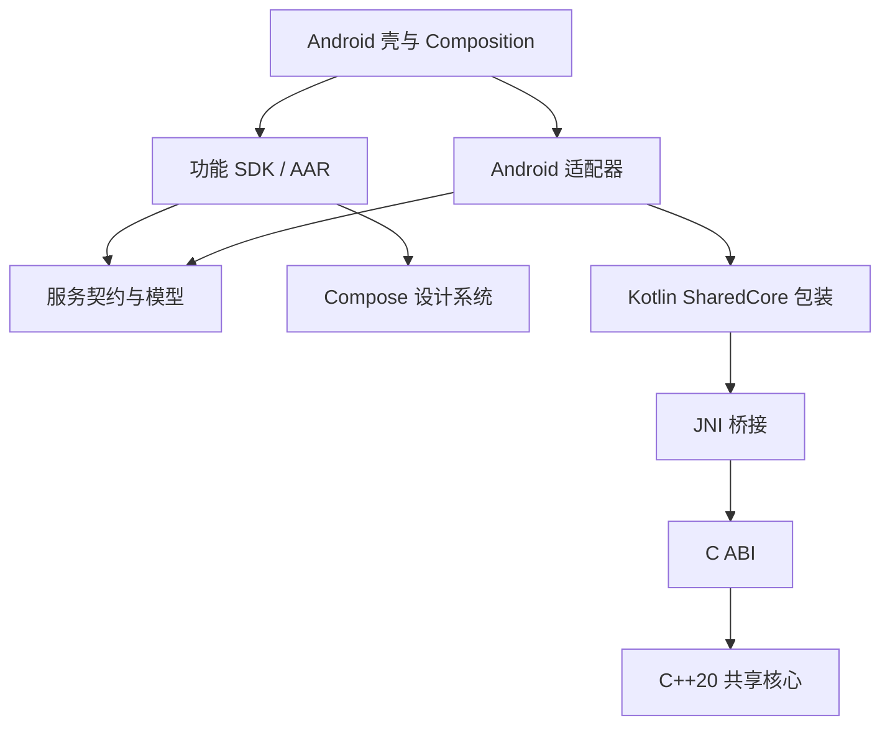

# Android 对齐 Apple 的壳工程与组件架构

整理日期：2026-09-23。
状态：架构基线已实现；本地验证记录见第 8 节，远端 CI 与真实产品交付仍需验收。
依据：当前仓库的 Apple 架构文档、组件与壳源码、产物脚本，以及 Android Gradle 与 Kotlin 源码。

## 1. 结论与范围

Android 应沿用 Apple 的核心决策：薄壳、按功能划分的组件、显式平台适配、C++20 共享核心、编译期 DI 校验，以及独立版本化的预编译组件交付。

统一的是职责、依赖方向、跨语言契约与交付规则。SwiftUI、XCFramework、SafeDI、Tuist 的 Android 对应实现需要采用 Kotlin/Compose、AAR/JAR、Android 适用的编译期 DI 和 Gradle/NDK。

用户已明确希望 Android 采用同样架构，并确认采用以下选型：

- 组件通过 Maven 发布预编译 AAR/JAR；Android UI、资源和 native 包装使用 AAR，纯 Kotlin/JVM 契约可用 JAR。
- 通过 Kotlin 包装与 JNI 接入共享 C ABI 和 C++20 核心。
- 编译期 DI 采用 Dagger，组件内部生成与校验，壳通过公开工厂组装。

已落地选型为 Dagger 2.52 Java annotation processor、NDK 28.2.13676358、CMake 3.22.1；原生 ABI 为 arm64-v8a 和 x86_64。保持现有手机/平板壳，其他设备按产品范围扩展。具体实现与验证边界见第 8 节。

## 2. Apple 当前真正采用的架构

完整决策见 [Apple 架构基线](apple-shell-component-architecture.md)，验收记录见 [Apple 核心与组件验证](apple-cpp-core.md)。早期文档中的候选描述，应结合架构文档第 14 节的实际实现阅读。

| 方面 | 当前实现与决策 |
| --- | --- |
| 产品壳 | 默认生成 iOS、macOS、watchOS、tvOS 四个壳，同一产品仓库；各平台不要求功能对等 |
| 职责 | 壳负责入口、生命周期、导航与公开工厂组装；功能组件依赖服务契约；适配层连接核心 |
| 源码组织 | `Components/Package.swift` 内含多个 Target；`Shared/Core/` 管理 C++、C ABI 与 Swift 包装；仓库、编译模块和发布单元不要求一一对应 |
| 二进制交付 | FoundationKit、SharedCore、HomeFeature 三个发布单元，内部合计五个编译模块；壳消费静态 XCFramework |
| DI | 已采用 SafeDI 2.0.0 CLI；组件和壳分别生成与校验，公开 API 不依赖 SafeDI 类型；描述输入与真实接口由 Swift 编译核对 |
| 状态与资源 | 应用共享会话工厂，窗口/页面持有独立会话；Swift 包装串行执行同一句柄操作，支持取消、任务保活和异步关闭 |
| 发布治理 | 独立版本、不可变产物、精确版本组合、清单摘要校验、显式本地二进制覆盖；CI/Release 拒绝覆盖 |
| 共享业务 | 跨平台一致的规则、领域状态和适合共享的用例进入 C++；UI、权限与平台流程留在外层 |

需要区分架构要求与示例覆盖：当前核心以有界整数批量计算演示会话、错误、取消和提交语义；没有真实数据库、迁移、同步或进度回调。四平台构建与测试通过是仓库已有的本地验收记录，本次整理没有重新运行验收；远端完整 CI、其他 Apple 平台真机运行与商店交付仍有待完成项。

## 3. 迁移前的 Android 现状与差距

下表记录本次实现前的差距，作为改造依据；当前结果见第 8 节。

| 当前证据 | 判断 | 对齐后的目标 |
| --- | --- | --- |
| `settings.gradle.kts` 包含 app、core 与 feature；app 使用 `implementation(project(...))` | 已按源码模块拆分，尚未成为独立二进制组件架构 | 产品壳按 Maven 坐标消费预编译组件；组件构建与产品构建分开 |
| `MainActivity` 直接展示 HomeRoute 与 SettingsRoute | 有基本 UI 壳，没有独立工厂组装与跨组件输出示例 | 增加 composition 组装入口，由壳接收类型化输出并决定导航 |
| `SettingsRoute` 内创建 `DefaultAppEnvironmentProvider()` | 功能直接选择具体实现，替换和测试边界不完整 | 构造时注入服务契约，具体实现由组装层选择 |
| `core/network` 仅提供环境配置模型与 Provider | 名称不能证明已有网络能力或业务数据层 | 按真实职责保留或调整，不为对齐预建大量空模块 |
| 有 model、designsystem、testing 与两个 feature | 已有可复用基础 | 演进为契约、设计系统、功能 SDK 和测试支持；测试支持不进入运行时 |
| 有固定版本目录、Wrapper 摘要与 verification metadata | 已有供应链校验基础 | 补充完整依赖图锁、组件发布清单、不可变版本和覆盖治理 |
| 未见 NDK/CMake、JNI 包装或应用编译期 DI 配置 | C++ 共享核心与分层 DI 尚未接入 | 加入 SharedCore Android SDK 与组件/壳分别校验的依赖图 |

依赖校验文件里出现 Dagger 的传递依赖记录，不等于应用已经采用 Dagger DI。版本目录和产物校验也不能代替完整解析依赖图的锁定。

## 4. Apple A01–A20 决策在 Android 上的对应

| 编号 | Apple 决策 | Android 对齐方式 |
| --- | --- | --- |
| A01 | 复制优先、不透明句柄、谁分配谁释放 | Kotlin 封装 native 句柄；JNI 不向业务暴露地址；提供显式安全关闭 |
| A02 | 稳定错误码、每次调用诊断、异常不越界 | 保留 C ABI 错误语义，映射为 Kotlin 类型化错误；JNI 自身异常也须处理 |
| A03 | 同一句柄串行、不同句柄可并行 | Kotlin 包装明确串行调度；耗时 JNI 调用移出主线程；`suspend` 本身不保证后台执行 |
| A04 | 协作取消、任务保活、关闭等待、完成一次 | 协程取消转发 native 取消令牌；原生操作实际结束后才释放句柄 |
| A05 | 类型明确、UTF-8 与长度、无损转换 | 明确 Kotlin/JNI/C 类型转换；检查长度与无符号数范围；不混用 Modified UTF-8 和标准 UTF-8 |
| A06 | 完整业务操作、有界批量、明确提交语义 | 沿用共享核心用例接口，避免 UI 高频调用细碎 JNI；明确取消与提交竞争时的结果 |
| A07 | 多个平台壳同产品仓库 | 同产品 Android 壳放在同仓；先保留现有手机/平板 app，Wear OS/TV 按实际范围增加 |
| A08 | 少量包、内部功能模块、成熟后独立仓库 | 组件开发可同仓多 Gradle 模块；发布单元按功能稳定边界划分 |
| A09 | 共享业务与适用状态，UI 按平台组织 | Kotlin/Compose 保持原生交互；不同设备导航、焦点与布局分别设计 |
| A10 | 编译期 DI、构造依赖、明确作用域 | 已实现 Dagger 2.52 Java 编译期生成与校验；应用/会话/功能实例分层，禁止业务访问全局容器 |
| A11 | 类型化输出、壳导航、领域服务共享状态 | 用 sealed 类型或类型明确的回调表达意图；传稳定 ID，不传其他组件 ViewModel 或 native 句柄 |
| A12 | 分层测试、确定性预览、真实二进制验收 | 核心、JNI、组件、Compose 与壳分别验证；增加消费发布产物的集成工程 |
| A13 | 跨平台权威规则与领域状态进入 C++ | 复用同一核心源码与 C ABI，不在 Kotlin 重写一份权威规则 |
| A14 | 按数据性质划分存储责任 | 核心定义共享格式与迁移；Android 适配存储访问、安全存储与系统授权；具体数据库按需求选 |
| A15 | 从开始就让壳接入预编译组件 | Android UI/资源/native 包装使用 AAR，纯 Kotlin/JVM 契约可用 JAR |
| A16 | 显式本地二进制覆盖、不可变预发布版本 | 本地组件先发布到隔离 Maven 目录，再显式覆盖；正式构建拒绝覆盖及隐式源码替换 |
| A17 | 独立版本、完整组合精确锁定、单独验证兼容 | Maven 坐标、Gradle 依赖锁与摘要共同管理；验证 Kotlin/JVM、Compose、JNI 与 native 兼容 |
| A18 | 组件自带资源、公共资源归设计系统、公开接口定制 | AAR 携带默认资源；明确资源前缀与公开资源范围；通过样式/配置接口定制 |
| A19 | 静态优先、公共核心唯一链接归属 | C++ 静态核心并入一个受控 JNI `.so`；功能 AAR 不各自携带完整核心，详见下节 |
| A20 | 组件内部 DI 校验，壳只组装公开工厂 | DI 生成在组件发布前完成；公开业务接口与工厂隐藏组件图，壳只验证自身可见依赖 |

## 5. Android 的建议结构与依赖方向

```text
AndroidProduct/
  app/                     # 当前手机/平板壳；其他设备壳按产品需要增加
  composition/             # 产品组装、公开工厂、会话与适配器
  dependencies/            # 产品组件声明、产物信息、本地覆盖配置
  gradle/                  # 版本目录、锁与校验配置（锁文件按 Gradle 布局放置）
  components/              # 可同仓开发，但使用独立组件构建入口
  shared/core/             # 共享核心接入及 Android 包装开发入口
  tests/                   # 产品级二进制集成验证
  scripts/                 # 构建组件、发布、锁定、覆盖诊断
```

目录为建议，不要求重命名现有文件才能实施。产品 Gradle 构建只包含壳和必要组装模块；组件使用独立 Gradle build，内部允许源码模块依赖。移动走组件源码之后，产品仍应能仅凭锁定产物构建。



契约、设计系统、共享核心和功能是逻辑边界；实际 Maven 发布单元不必照搬 Apple 的 FoundationKit 打包方式。只在跨发布边界确有共享需要时提取契约模块，避免重复发布同一套类。

## 6. 必须单独处理的 Android 决策

### 6.1 JNI 与链接

当前实现采用 `SharedCore AAR → 单个 JNI .so → 静态 C++ 核心`。这里沿用的是核心归属唯一和静态内部组合的原则，Android 运行时仍需加载 JNI 共享库；AAR 本身不是静态链接库。

Kotlin 包装负责调用调度、持有任务资源、错误映射和安全关闭。JNI 仅负责类型转换和转发，不复制领域规则。不得把某线程的 `JNIEnv` 交给其他线程使用；字符串转换需要区分标准 UTF-8 与 JNI 的 Modified UTF-8；跨调用引用须有明确释放路径。这些是 Android 官方 [JNI 契约](https://developer.android.com/ndk/guides/jni-tips) 对包装实现的额外约束。

核心源码的权威来源为仓库 `shared/core/`，通过 `scripts/sync-shared-core` 同步到两套自包含模版；测试检查逐字节一致，禁止分别维护。平台包装仍在各自模版中。生成后的独立产品拥有交付副本，后续跨仓协作应消费同一版本化核心源码来源；Apple 的预编译产物不能直接给 Android 使用。

固定 NDK/CMake 和目标 ABI，检查 native 符号与运行库。单一 JNI 库可优先验证静态 libc++；如果引入其他 native SDK，则重新评估运行库、符号隔离与所有权，不能在多个 `.so` 中盲目静态复制运行库。面向外部分发的通用 AAR 与团队统一构建的应用应分别验证。参见官方 [C++ 运行库说明](https://developer.android.com/ndk/guides/cpp-support)。

### 6.2 编译期 DI

已确认采用 Dagger 的组件内部生成加公开工厂方案，与 Apple 已选用的分层生成思路一致。Hilt 不属于本次已确认选型，可在 Android 壳生命周期集成确有收益时单独评估。

组件与壳的独立 Dagger 编译、缺失依赖和环路反例已通过本地验证。官方 [Dagger 多模块文档](https://developer.android.com/training/dependency-injection/dagger-multi-module) 提供分层组件与作用域的基础能力，本工程通过 Java 图定义与 annotation processor 生成构造代码，公开 Kotlin 工厂不暴露 DI 图；不引入 kapt/KSP。版本升级仍需重新验证二进制消费与工具兼容。

应用共享服务工厂；文档/业务会话持有隔离的有状态核心对象。DI scope 不自动等于资源销毁协议，仍需显式等待任务结束并关闭。

### 6.3 Android 生命周期

应明确业务会话和 Activity/Compose UI 的关系：配置变化不应意外新建或关闭仍需保留的会话；离开页面是否取消任务取决于任务归属。应用级任务不能无条件挂在页面 scope 上。

包装层提供异步关闭语义：停止接受任务、发起取消、等待 native 操作结束、释放句柄，重复关闭安全。不能把“协程被取消”当作“同步 JNI 调用已结束”，也不能仅依赖最终清理器释放资源。

进程重建只能恢复稳定 ID 与可持久化数据，不能恢复内存中的 native 句柄。协程的取消与结果交付存在竞争，须把“核心操作提交结果”和“UI 是否继续接收通知”分别定义并测试，不能因 UI 放弃接收就误判核心写入未发生。

### 6.4 二进制发布与可复现构建

采用具备 POM/Gradle 元数据的 Maven 发布，保留传递依赖信息；本地联调也使用显式的隔离仓库。官方提供 [Maven 发布和本地仓库路径](https://developer.android.com/build/publish-library/upload-library)，因此无需把复制裸 AAR 作为默认交付方式。

复用现有供应链校验，增加完整依赖图锁定；版本目录负责版本声明，dependency locking 负责解析版本稳定，verification metadata 负责内容校验，这三者职责不同。参见 [Gradle 依赖锁定](https://docs.gradle.org/current/userguide/dependency_locking.html)。

发布清单记录源码修订/摘要、工具链、minSdk、ABI、依赖、资源与 native 调试符号。版本不可覆盖；正式构建拒绝本地覆盖、动态版本和隐式源码 substitution。二进制缺失或不兼容时明确失败。

Compose 公共 API、Kotlin 元数据、JNI 方法、资源和混淆规则都属于交付契约。AAR 独立发布后仍要重新构建应用，不能视作安装后的代码热替换机制。Release 已启用 R8，并随 SharedCore AAR 发布 JNI consumer rules；构建与运行分别验收，不能仅以压缩成功证明运行正确。

### 6.5 设备范围

Apple 的四壳决策不应机械映射为 Android 四个 app。建议第一阶段保留手机/平板壳，后续根据产品范围增加 Wear OS、TV 等壳；同一仓库共享锁定组件，不强制所有设备拥有相同 UI 或功能。

## 7. 实施顺序与验收标准

| 阶段 | 工作 | 完成标准 |
| --- | --- | --- |
| 1. 共享核心闭环 | 确立跨平台核心源码来源，完成 NDK/CMake、JNI、Kotlin 包装与 SharedCore AAR | 真正调用 C ABI；覆盖溢出、取消、独立会话、并发提交/关闭、重复关闭和关闭后拒绝工作 |
| 2. 功能组件与 DI | 抽取服务契约，改为构造注入；Home 使用真实核心适配器；引入组件与壳分别校验的 DI | Fake 可替换服务；缺失依赖和非法环路正确失败；公开工厂不要求扫描 SDK 内部源码 |
| 3. 二进制交付 | 组件独立构建/发布；产品改为 Maven 消费；实现精确锁、产物校验与显式覆盖 | 移走组件源码仍能构建；单组件升级可验证；篡改/缺失产物及 CI/Release 本地覆盖被拒绝 |
| 4. 产品级验收 | 验证生命周期、资源、导航、混淆、ABI 与真实设备运行 | 发布产物在壳内调用、关闭、恢复流程可用；符号可定位到源码；生成模版和 CLI 回归通过 |

每个阶段先完成可运行的小闭环，避免同时扩展大量业务模块与设备壳。保留现有 Wrapper、工作树隔离、签名和发布流程，在其上补齐组件契约。

上述阶段已落实为模版中的可执行入口。设备壳与外部仓库按实际产品需求扩展。


## 8. 已实现的模版与验收边界

- 产品 `settings.gradle.kts` 只包含 `app`，`components/` 是独立 Gradle 构建；SDK 源码仍按原有 `core/`、`feature/` 目录组织，减少迁移成本。
- 发布 model、designsystem、network、testing、sharedcore、home、settings 七个小型 AAR。testing 仅用于测试依赖；当前 Android 库统一使用 AAR，未来纯 JVM 契约可独立提取 JAR。
- Home SDK 内部和产品壳分别运行 Dagger 编译。HomeFactory 使用公开 AnalysisService；SettingsRoute 显式接收环境服务。壳处理 HomeOutput 导航意图。
- 每个 SessionOwner 创建独立会话图，ViewModel 保留配置变化期间的会话；onCleared 发起关闭。Kotlin 包装复制输入、串行调用、转发取消并在实际结束后释放 native 资源；close 可等待完成且幂等。
- `scripts/components` 提供 bootstrap、publish、lock、resolve、verify、info 和 override；同版本不可覆盖，源码缺失不回退，产物/清单摘要、POM 依赖、ABI、资源和核心链接归属均校验。
- 正式 Gradle 构建在 settings 阶段验证锁定 SDK；Release 构建任务额外验证覆盖策略，Android Studio 直接构建同样适用。
- 产品与组件都有 Gradle 依赖锁和第三方摘要校验。团队 SDK 由组件锁校验，Maven 仓库的专属 group 避免其他仓库静默替代。
- 原生发布目录保存每个 ABI 的匹配未剥离符号；清单记录源码摘要和固定工具链。默认仓库为本地目录，未配置远端发布账户。
- `scripts/test-native` 运行真实主机 JVM/JNI 测试；`scripts/verify-di` 运行组件与壳的四个故意错误图；模拟器测试覆盖发布核心、资源、计算、导航和 Activity 重建。

本地验收结果单独记录于 [Android 组件验证](android-component-verification.md)。CI 工作流已加入 `.github/workflows/android-components.yml`，本次未获得远端运行结果。

这是一套可运行架构基线。真实业务持久化、跨设备同步、长任务进度、真机性能、正式签名和商店发布不由示例代替。默认支持的两个 ABI 之外的设备需要扩充构建矩阵；minSdk 低于 21 的输入被拒绝。
