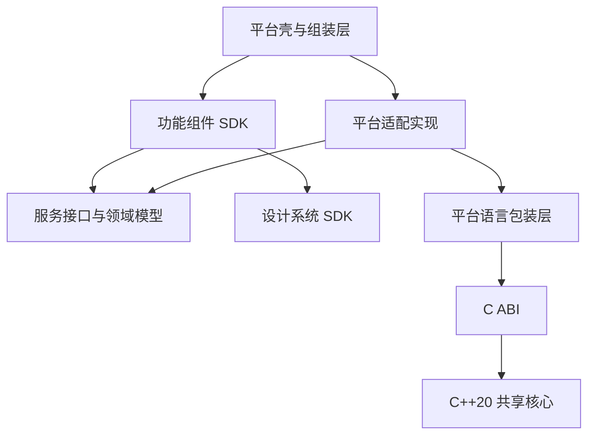

# Apple 四平台壳工程与组件架构

状态：架构基线已落实到模版；产品专属能力与外部交付仍需按项目验收。
整理日期：2026-09-22；实现更新：2026-09-23。
适用范围：BiucingCLI Apple 模版及其生成的产品工程。

本文汇总已逐项确认的架构决策，作为后续设计、技术验证和实现的共同基线。
“已确认”表示方案已接受，不表示代码已经落地或候选框架已经验证通过。
目录、功能名称和接口名称均为示例；具体实现不得把示例误当成额外的业务需求。

## 1. 目标与技术基线

采用薄壳工程、功能组件、平台适配层和 C++ 共享核心的架构。

- 同一个产品的 iOS、macOS、watchOS、tvOS 四个壳工程放在一个仓库。
- 创建产品时默认生成四个平台壳，不要求四个平台同时上线或提供完全相同的功能。
- Apple 代码以 Swift 6.4 为最低工具链基线，使用 Swift 6 语言模式；界面使用 SwiftUI。
- 跨平台共享核心以 C++20 为标准，通过 C ABI 与平台包装层对接。
- Tuist 管理 Apple 工程；SwiftPM 管理包依赖与组件开发；CMake 支持核心独立构建。
- 组件以预编译二进制接入壳，按稳定功能边界独立版本化发布。
- 静态二进制为默认；动态链接须有明确需求并单独验证。
- 引入编译期依赖图校验型 DI：SafeDI 为首选验证候选，Needle 为备选。

Swift 的 `SWIFT_VERSION=6.0` 表示语言模式，不代表使用 Swift 6.0 编译器。
共享核心面向 Apple、Android、HarmonyOS、Windows、Linux 的源码复用；
二进制需按平台、架构和 SDK 分别构建，Apple 产物不能直接用于其他平台。

## 2. 决策总表

| 编号 | 范围 | 已确认决策 |
| --- | --- | --- |
| A01 | 内存 | 普通数据优先复制；有状态对象使用不透明句柄；谁分配谁提供释放；零拷贝按性能证据引入 |
| A02 | 错误 | 稳定错误码、每次调用独立的可选诊断信息；平台转换为原生错误；异常不跨 C ABI |
| A03 | 线程 | 无状态函数可并发；同一句柄默认串行，不同句柄可并行；平台包装层负责调度 |
| A04 | 生命周期 | 协作式取消；任务持有资源；关闭等待安全结束；任务只完成一次；明确归属 |
| A05 | 数据格式 | 类型明确的 C 接口；UTF-8 与长度；数值、单位、空值明确；禁止有损转换 |
| A06 | 调用粒度 | 完整业务操作为主，保留轻量查询和有界批量接口；明确失败、原子性和重试语义 |
| A07 | 产品仓库 | 四个平台壳放在同一产品仓库，默认全部生成 |
| A08 | 模块划分 | 少量 Package，内部按功能拆 Target；独立发布需求成熟后可以提取独立 Package／仓库 |
| A09 | 界面复用 | 共享业务与适用的状态逻辑，界面按平台组织，小控件按需复用 |
| A10 | DI | 编译期校验型框架；保留显式初始化依赖、明确作用域和资源显式关闭 |
| A11 | 通信导航 | 类型明确的输出表达意图；壳协调跨组件导航；领域服务共享状态；广播按需使用 |
| A12 | 验证 | 分层测试、独立组件测试、确定性预览、按需宿主、DI 失败案例与四平台构建 |
| A13 | 业务归属 | 跨平台一致的规则、领域状态和适合共享的用例进入 C++；平台流程留在外层 |
| A14 | 持久化 | 按数据性质划分责任；统一产品数据格式与迁移；具体存储技术按需选择 |
| A15 | 二进制交付 | 从一开始按预编译组件接入壳，支持独立仓库开发；按稳定功能边界发布 |
| A16 | 联调 | 显式本地二进制覆盖；不可变预发布版本用于团队集成；正式构建仅用锁定产物 |
| A17 | 版本 | 组件独立版本化；产品精确锁定完整版本组合；二进制兼容性单独校验 |
| A18 | 资源 | 组件自带默认资源，公共资源归设计系统，应用级资源归壳；定制走公开接口 |
| A19 | 链接 | 静态为默认；公共核心统一管理链接归属；不得私自重复封装公共核心 |
| A20 | DI 与 SDK | 组件内部生成和校验 DI；壳组装公开依赖与工厂；公开 API 尽量不暴露 DI 类型 |

早期讨论过“源码依赖作为默认”，但最终决策已改为预编译二进制接入。
产品仓库共享的是同一套锁定组件产物；组件仓库内部仍然管理和开发源码。

## 3. 壳与组件的职责

| 部分 | 职责 | 边界 |
| --- | --- | --- |
| 平台壳 | 入口、生命周期、根导航、组件组装、权限、应用配置和签名配置 | 不直接实现业务规则、数据库操作和算法 |
| 功能组件 | 一个完整功能的界面、状态、交互、用例调用及内部导航 | 不依赖整个 App，不访问其他组件内部状态 |
| 服务接口与模型 | 定义组件协作所需的能力、输入输出和错误语义 | 不泄露具体存储 SDK、视图对象或 C++ 裸指针 |
| 平台适配层 | 实现系统能力、存储访问、网络接入和共享核心适配 | 不复制跨平台权威业务规则 |
| C++ 核心 | 共享算法、规则、领域状态、状态机和适合共享的用例 | 不依赖 SwiftUI、JNI、ArkTS 或平台应用生命周期 |
| 设计系统 | 视觉规范、公共控件与无障碍约定 | 不承载具体业务流程 |

代码依赖方向如下；运行时实现由壳或组件工厂注入：



组件对服务接口的依赖不要求每个协议都拆成独立发布包。
只有需要跨发布边界共享的契约，才应具有明确且唯一的模块归属。

## 4. 仓库、编译模块与发布单元

三个边界分别管理：仓库是源码协作边界，Target 是编译边界，SDK 是交付边界。
不要求它们一一对应。

产品仓库的示意布局：

```text
Product/
  Apps/
    iOS/
    macOS/
    watchOS/
    tvOS/
  Composition/           # 四个平台的公开工厂组装与依赖映射
  Dependencies/          # 组件依赖声明、精确锁定与产物信息
  Tests/                 # 产品级集成验证
  Scripts/               # 依赖获取、覆盖诊断、构建与发布入口
  Workspace.swift
```

组件开发仓库的示意布局：

```text
ComponentRepository/
  Package.swift          # 可包含多个 Target
  Sources/
  Resources/
  Tests/
  Examples/              # 按需建立调试宿主
  Scripts/               # 构建、打包、校验和发布
```

共享核心开发仓库管理 C++ 源码、C ABI、CMake、平台包装层及相应测试。
组件源码初期可以与产品同仓，但正式壳构建仍消费发布产物，不能隐式改为源码依赖。
独立仓库数量、包名和目录名在实现阶段确定，不预先建立大量空仓库或空模块。

示例发布单元包括共享核心 SDK、资料库 SDK、编辑器 SDK 和设计系统 SDK。
共享核心、C ABI 与紧密配套的 Apple 包装层协调发布；组件内部允许多个 Target。

## 5. 四个平台的复用边界

- 共享业务规则、用例、模型，以及确实与设备无关的状态逻辑。
- 窗口、导航、焦点、动画、平台选择状态等由平台界面层管理。
- 小控件按适用性共享，不强求四个平台使用同一个完整 View。
- 平台差异小时先用独立文件组织；依赖、差异或编译隔离需求明显后再拆 UI Target。
- 每个平台只接入需要的功能，默认存在四个壳不代表功能完全对等。

例如同一资料库能力：iOS 使用列表与详情，macOS 使用侧栏和窗口，
watchOS 展示近期内容或快捷操作，tvOS 提供适合焦点与遥控器的浏览界面。
这些交互是设计示例，不是当前模版已经完成的能力。

## 6. C++ 与平台语言的六项契约

### 6.1 内存所有权

- 普通输入在调用期间借用，普通结果优先转换为平台自己管理的数据。
- 引擎、文档、会话等有状态对象使用不透明句柄，由平台对象封装。
- 谁分配，谁提供释放入口；平台不直接释放 C++ 分配的内存。
- 长期资源提供显式 `close/dispose`，自动清理作为兜底，避免重复释放。
- 零拷贝仅在性能证据明确后引入，并另行定义缓冲区借用、租借及并发规则。
- C++ 内部可以采用 RAII；边界不暴露 STL 容器和 C++ 对象布局。

### 6.2 错误处理

- 使用稳定错误码与当前调用独立关联的可选诊断信息。
- 平台包装层转换为原生错误；业务逻辑不通过匹配错误文案做判断。
- 诊断文案供排查，用户提示由平台本地化生成，不直接展示原始诊断内容。
- 不使用全局“最后一次错误”；C++ 异常在边界内捕获和转换。
- 错误处理尽量避免内存分配，尤其是内存不足路径。
- 默认失败时保持输出参数不变；部分结果必须由具体接口显式定义。
- 空搜索结果等正常业务分支使用成功结果表达。

### 6.3 线程与回调

- 无共享可变状态的函数可并发调用。
- 同一句柄默认串行，不同句柄可以并行；全局缓存等共享状态另行同步。
- 串行不等于固定操作系统线程；需要线程亲和性的组件必须显式声明。
- 平台包装层负责调度，耗时操作不占用 UI 线程。
- C++ 内部并行按需引入，约束总并发量，避免每个对象无限创建线程。
- 不在持有内部锁时调用外部回调，默认不允许回调同步重入同一句柄。
- 包装层将通知交给明确执行环境，UI 更新回到 UI 线程。
- Swift `async` 不自动代表后台执行；actor 也不保证跨挂起点的整段操作不可交错。

### 6.4 取消与生命周期

- 使用协作式取消；取消请求幂等，“请求取消”不等于“已经结束”。
- 每个已接受任务恰好完成一次：成功、失败或取消。
- 任务运行期间持有资源有效引用；页面消失不能释放仍被任务使用的句柄。
- 关闭时停止接受新任务、请求取消、等待安全结束，最后释放；UI 不阻塞等待。
- 已完成任务不因稍后到达的取消而改变结果；完成后不再发送进度。
- 包装层丢弃已排队的过期界面通知。
- 明确页面、文档会话、应用级任务归属；离开页面不默认取消应用级导出任务。
- 取消不自动回滚；写入操作必须定义提交点、事务或临时产物处理方式。
- 不可取消的第三方调用需说明限制；等待超时不能成为提前释放资源的理由。

### 6.5 数据表示

- 进程内默认采用类型明确的 C 接口；序列化协议按实际需求引入。
- 字符串使用 UTF-8 与显式字节长度，不依赖终止符判断长度。
- 整数采用固定宽度类型；金额等精确数据明确单位和表示方式。
- 数组和二进制使用指针与长度，明确长度是元素数还是字节数。
- 缺失、空字符串、空数组和零值不能混为一谈。
- 枚举采用固定宽度整数与明确常量，包装层处理未知值。
- 时间明确纪元、单位和时区语义，区分时间点与持续时长。
- 平台表示范围不足时必须检查并转换为约定的无损表示，不静默截断或丢失精度。
- 核心验证接口条件与业务规则；调用方仍负责指针实际有效性和契约生命周期。
- 已发布接口不随意改变布局或含义；需要时增加新接口或显式版本字段。

### 6.6 调用粒度

- 一个调用优先对应完整业务操作，如分析、搜索、批量修改或导出。
- 保留必要的轻量查询，批量接口设置边界，大数据按需分块、分页或流式处理。
- 跨平台必须一致的业务编排留在核心；权限、导航和文件选择留在外层。
- 长任务支持取消和限频进度通知。
- 每个操作声明成功含义、失败后的状态、部分结果与事务原子性。
- 批量执行不自动等于事务；失败不默认自动重试，有副作用的操作需明确幂等性。
- 调用粒度与调度方式分开：完整用例并不要求 C++ 自己管理后台线程。

## 7. 依赖注入与作用域

采用编译期校验型 DI，SafeDI 为首选候选，Needle 为备选；具体版本与适配方式待实测定版。
不把框架项目的能力声明当作本工程已经通过的验证结果。

保留三条规则：

1. 组件通过初始化参数接收依赖，不访问全局容器。
2. 明确应用、窗口／文档会话、功能实例的作用域；注册不等于单例。
3. C++ 资源关闭仍遵循取消、等待与显式关闭规则，不仅依赖 DI 容器释放。

四个平台壳各自拥有组装入口，共用必要的工厂与配置逻辑。
应用级服务可以共享，同一应用中的两个文档会话必须获得隔离的有状态对象。

二进制边界采用分层生成：

```text
组件源码 → 组件内部 DI 校验／生成 → SDK 与公开工厂
                                            ↓
产品壳 → 公开依赖与工厂组装 → 壳侧 DI 校验 → 应用
```

组件发布前校验内部依赖；壳不重新扫描 SDK 内部源码。
公开 API 尽量使用业务协议和工厂，不暴露框架专用类型。
如果候选工具需要随包依赖描述，必须纳入明确的发布契约并验证版本兼容性。
分层编译检查不能证明服务语义、资源释放、线程安全或整套系统行为正确。

## 8. 组件通信与导航

- 功能组件通过类型明确的输出表达意图，例如 `openDocument(DocumentID)`。
- 壳决定跨组件跳转方式，组件自行管理内部流程。
- 导航传稳定 ID 和必要的小型上下文，不传其他组件内部 ViewModel 或裸句柄。
- 命令用于请求操作及接收结果，状态表示当前事实，事件表示已经发生的事情。
- 业务状态经领域服务共享；编辑器保存数据后，资料库观察数据更新。
- 广播只用于确有多个订阅者的情况，明确订阅生命周期、执行环境和初始状态语义。
- DI 负责对象组装，不负责业务消息转发；输出闭包必须避免引用环。

## 9. 业务状态与持久化

跨平台一致的业务规则、领域状态与适合共享的用例进入 C++。
平台交互、系统权限和应用流程留在外层；网络与存储是否进入核心按实际复用收益判断。
每份业务状态只有一个权威来源；UI 可以持有展示快照，修改通过权威服务提交。

| 数据 | 归属 |
| --- | --- |
| 跨平台文档、项目内容 | 共享层定义格式、版本和迁移规则 |
| 业务记录、索引 | 根据查询、事务和共享需要选择存储实现 |
| 窗口位置、平台导航恢复 | 平台侧 |
| 密钥、令牌 | 平台安全存储，由适配接口访问 |
| 可再生成缓存 | 使用它的组件，明确清理策略 |

持久化模型与 UI 模型分开；长期格式有版本，不支持的新格式不得静默覆盖。
保存成功由具体存储方案定义，并验证事务、原子替换和失败恢复等所需语义。
平台先取得访问授权，再通过数据、流或受控存储能力交给共享逻辑。
共享格式不等于跨设备同步，冲突合并、离线修改和同步协议仍需按产品需求设计。

## 10. 二进制发布、版本与链接

组件按稳定功能边界发布，不以每个 Target 为强制发布单位，也不默认打成唯一大 SDK。
组件开发拥有源码、测试和按需宿主；产品正式构建仅消费版本化产物。

发布契约应能确定：

- 组件版本、源码提交、构建工具链及产物校验信息。
- 支持的平台、架构、最低系统要求与组件依赖关系。
- 公开接口、资源、调试符号及源码对应关系。
- 与该组件紧密配套的生成工具或依赖描述版本（如实际需要）。

组件采用语义化版本，产品精确锁定直接和间接依赖的完整组合。
版本号表达兼容承诺，但不能代替测试；源码兼容也不等于二进制兼容。
缺乏充分兼容保证时，底层组件变化需要重建下游预编译 SDK。
升级通过显式变更及验证完成；同一版本产物不可覆盖。
二进制回滚恢复上一套锁定组合，涉及数据迁移时还必须评估旧版本可读性。

静态链接为默认：

- 功能 SDK 声明共享核心依赖，不私自携带多份完整核心实现。
- 最终应用统一管理公共核心链接归属，检查重复符号及同进程全局状态分裂风险。
- 同进程唯一性不代表不同平台应用或不同进程共享同一个实例。
- 静态代码链接与资源复制分别验证。
- SDK 独立发布不意味着已安装应用能自行替换代码；组件升级后重新构建应用。
- 动态链接按明确收益、平台约束及验证结果引入。

具体产物格式、托管服务、包清单生成方式、符号分发和兼容策略仍待技术验证确定。

## 11. 联调与构建可复现性

```text
组件修改 → 组件测试 → 本地 SDK 构建 → 壳显式覆盖联调
                                  ↓
                         不可变预发布版本
                                  ↓
                         团队集成与产品锁定
```

- 个人联调使用本地二进制覆盖，不默认切换到源码接入。
- 覆盖配置不提交，诊断命令明确显示组件来源、版本和源码提交。
- 平台、架构或依赖不匹配时明确失败，不静默回退。
- 提供稳定的构建、设置覆盖、查看覆盖和清除覆盖入口；具体命令名待实现。
- CI 正式发布构建拒绝本地覆盖，只消费锁定产物。
- 本地二进制保留可用调试信息，防止源码与实际运行产物不对应。
- 第三方运行库、宏与生成器固定经过验证的匹配版本。
- 生成代码不手工修改；干净构建可重建，输入变化触发正确增量生成。
- 编译缓存属于优化手段，不能成为干净构建或依赖可获取性的前提。

## 12. 资源交付

- 功能图片、本地化文案、内置模板等随组件代码版本化发布。
- 公共视觉资源由设计系统统一管理，避免多个组件复制。
- 应用图标、名称、权限说明、签名能力及产品配置归壳。
- 产品通过主题、配置等明确接口定制，不修改 SDK 内部文件。
- 资源在所属组件范围查找，不假定都位于主应用包或使用全局唯一文件名。
- 大型模型和素材按需独立交付，定义版本、校验、缺失及更新处理方式。
- 直接验证发布产物中的资源，不能只依赖源码工程下的成功结果。

## 13. 验证体系

| 层级 | 验证内容 |
| --- | --- |
| C++ 核心 | 规则、边界输入、错误、并发与取消 |
| 跨语言集成 | 数据转换、错误映射、句柄生命周期、关闭与释放 |
| 功能组件 | 状态变化、用例调用、类型化输出，使用 Fake 依赖 |
| 平台界面 | 布局、交互、无障碍及窗口、焦点、表冠等平台行为 |
| 壳工程 | DI 组装、导航、配置与关键完整流程 |
| 二进制交付 | 实际发布产物接入、资源完整性、符号、依赖与平台覆盖 |

预览使用确定性数据，覆盖必要的正常、加载、空结果和失败状态。
复杂导航、权限、窗口等使用实际平台宿主验证，宿主调用组件正式公开入口。
调试宿主按需建立，不为每个组件四个平台预先建立空工程。

CI 按改动范围执行相关测试，合入主干前检查四个壳的构建。
核心和桥接变化需覆盖相应平台集成；发布使用实际二进制产物进行验证。
DI 必须包含故意缺失依赖和非法依赖环的失败案例，确认检查真正生效。

## 14. 已落地的模版实现

模版现在一次生成四个平台壳；`--platform` 兼容保留为默认操作平台，
`make build PLATFORM=macos` 可选择单个平台。四个 Bundle ID 分别使用平台后缀。
旧项目不自动原地迁移；应重新生成后迁移业务、应用标识及签名配置。

实际目录是 `Apps/`、`Composition/`、`Dependencies/`、`Components/` 和 `Shared/Core/`。
源码开发包有多个 Target；交付单元为 FoundationKit、SharedCore、HomeFeature。
壳仅依赖静态 XCFramework，不再通过本地 SwiftPM 依赖间接编译组件。
C++ 原生实现只属于 SharedCore，功能组件通过服务协议请求能力。

SafeDI 正式选用 2.0.0 CLI。组件和壳分别维护独立 DI 描述输入，
官方生成器校验依赖图并生成普通构造函数；真实 Swift 编译校验构造函数与实际接口。
输入文件不编译、不发布，SDK 公开 API 不依赖 SafeDI 类型。此方式与宏插件源码集成有区别，
构造接口变更时须同步描述；模版的生成及编译测试负责发现不一致。
壳通过公开工厂完成组装，完全不扫描隐藏组件源码。
应用作用域共享 SessionFactory，每个窗口/页面创建独立会话，并显式异步关闭。

C++ 示例已包含不透明会话、原子取消令牌、有界批量计算、溢出检查、
失败不修改输出/状态、独立会话状态和每次调用诊断。
Swift 包装实现串行调度、任务保活、取消、拒绝关闭后工作及幂等异步关闭。
示例没有进度回调和持久化副作用；增加这些能力时仍须遵守第 6 节完整契约。

`make components-bootstrap` 显式构建初始组件并生成精确锁；`scripts/components`
支持按组件独立发布、校验、解析和本地覆盖。相同版本禁止覆盖。
发布目录记录源码摘要、工具链、依赖、平台架构、静态库、Swift interface/ABI 描述、
资源和符号说明。资源随功能 SDK 交付，默认内容可通过公开样式接口定制。
组件内静态对象保留 DWARF，应用归档负责最终 dSYM。
更新版本组合后必须重新构建和测试四壳，不能仅凭语义版本断言二进制兼容。

默认产物仓库位于工作树 `.artifacts/`；`COMPONENT_REGISTRY` 支持团队同步后的本地路径。
尚未配置外部上传/下载服务、发布认证及远端符号服务器，模版不会主动创建外部账户或发布资源。
组件独立仓库可交付相同清单和目录格式，产品壳按锁消费即可。
本地覆盖被 Git 忽略，CI 与 Release 拒绝；直接 Xcode Build 也会执行锁定文件校验。

## 15. 验证边界与产品待定事项

实现与本地验证记录见 [Apple 核心与组件验证](apple-cpp-core.md)。
仓库包含可移植核心的 macOS/Linux/Windows CI，以及需要配置
`apple-swift64` macOS runner 的四平台完整验收工作流；远端尚未执行。
将完整验收启用为合入门禁，需要团队先配置满足 SDK、工具和模拟器要求的 runner。

以下内容仍然取决于具体产品，不能由模版测试替代：

- 外部产物托管、身份认证、签名证明及符号/源码访问服务。
- 真实业务组件、平台功能范围、平台 UI 交互及无障碍验收。
- 数据库、文件格式、网络与同步方案，以及数据迁移策略。
- HarmonyOS Node-API、Windows/Linux UI 与平台适配层。Android 模版的 JNI 与组件实现见
  [Android 架构](android-shell-component-architecture.md)，产品仍需完成各自平台验收。
- iOS/watchOS/tvOS 真机、开发者签名、macOS 公证和商店交付。

macOS 集成测试在实际 Mac 上运行；其他 Apple 平台测试使用模拟器。
真机 SDK 的静态切片编译成功不等于完成真机运行或签名交付验证。
