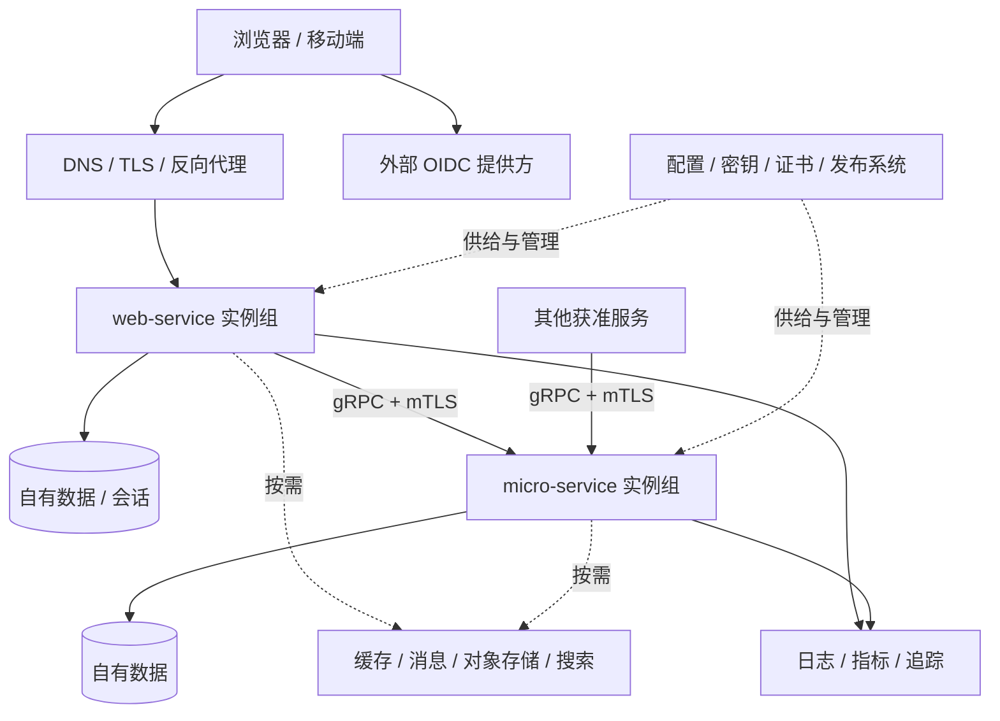

# 后端服务整体架构

状态：2026-09-26 架构方向已确认；描述目标架构，不代表模板已经实现。
P0 的选型、组件配置与验证入口见 [工程契约](backend-service-engineering-contract.md)。
实施顺序、依赖和验收见 [后端服务架构实施任务](backend-service-implementation-tasks.md)。
本文是两类后端模板共同的架构基线。具体入口分别见 [Web Service](web-service-architecture.md)
与 [Micro Service](micro-service-architecture.md)。本轮不定义业务模型、示例业务状态机或领域拆分。

## 1. 目标与已定边界

- `web-service` 面向浏览器、移动端等终端用户，提供公开 HTTP API 和用户身份入口。
- `micro-service` 面向其他服务，提供内部调用契约和工作负载身份入口。
- 两者都是可独立运行、测试、部署、扩缩容和维护的 Go 服务；共用生产能力标准。
- Docker 承担开发工具链、测试环境和运行镜像交付；Compose 同时支持本地开发和单机生产。
- 默认持久化接入 PostgreSQL。延续既有 OIDC、浏览器服务端会话、内部 gRPC/mTLS 方向。
- 同步跨服务调用由调用方和服务方共同负责；Web Service 也可以是 gRPC 客户端。
- 高可用按实际故障场景验收。之前选定的 Kubernetes + 托管 PostgreSQL 保留为多机生产参考，
  不作为本地开发或单机部署的前置条件；Docker 构建的 OCI 镜像可供它运行。
- 先前讨论的待办、订单、库存、个人/组织资源模型不再作为通用架构决策。

“通用组件齐全”意味着需要时有清楚的接入方式、责任和验收，不意味着每个项目同时启动所有中间件。
以下选型是本轮建议基线；精确依赖版本在实施时固定并验证。

## 2. 系统拓扑与责任



一个模板生成一个独立服务项目，不生成整个平台或一群互相依赖的服务。
每个服务可以含多个内部模块；协议角色不决定服务是否持有数据，也不决定模块数量。
内部服务之间允许按契约调用，避免循环依赖、无上限扇出和过深的同步链。

| 责任层 | 提供内容 | 不下放给服务进程的责任 |
| --- | --- | --- |
| 服务应用 | 协议、安全接入、授权入口、数据适配、出站调用、生命周期、遥测 | 集群调度、证书签发、备份设施 |
| 反向代理/入口 | TLS、路由、连接及请求限制、流量切换 | 最终资源授权和业务事务 |
| 数据及中间件 | 持久化、消息投递、缓存或对象保存 | 应用的访问权限与一致性策略 |
| 部署与运维平台 | 镜像仓库、配置/密钥分发、证书、编排、日志留存、告警、备份恢复 | 服务内部规则 |

## 3. 默认组件：每个生成项目都需要具备

“接入能力默认具备”不等于“外部设施由模板自动创建”。

| 组件 | 通用职责 | Web Service 的入口差异 | Micro Service 的入口差异 |
| --- | --- | --- | --- |
| 启动与组装 | 显式构造依赖、初始化顺序、失败清理、构建信息 | HTTP 服务组装 | gRPC 服务组装 |
| 配置 | 类型化配置、校验、覆盖顺序、脱敏输出 | 域名、CORS、OIDC、会话 | RPC 监听、对端身份、证书 |
| 密钥与证书 | 挂载文件/密钥服务接入、权限、轮换 | OIDC 客户端凭据、会话相关密钥 | 客户端/服务端证书、信任根 |
| 入站协议 | 路由/注册、大小限制、超时、取消、校验 | Gin + REST/JSON；OpenAPI | grpc-go + Protobuf；Buf |
| 请求管线 | 请求 ID、trace、日志、恢复、鉴权、限流与指标 | HTTP middleware | unary/stream interceptor |
| 身份认证 | 将已验证凭据转成显式 Principal | OIDC、浏览器会话、移动端 access token | mTLS 工作负载身份 |
| 授权 | 默认拒绝、显式权限策略入口、审计钩子 | 用户与资源范围由项目定义 | 调用服务/方法权限，必要时用户上下文 |
| 错误与契约 | 类型化错误、稳定错误码、版本与兼容检查 | HTTP 状态和公开错误体 | gRPC status 和受控 details |
| 持久化接入 | PostgreSQL pool、事务边界、连接预算、查询超时 | 会话需要数据库；可接自有数据 | 数据适配可按服务需求启用 |
| 迁移 | 独立迁移命令、版本和互斥、兼容检查 | 共享规则 | 共享规则 |
| 出站客户端 | HTTP/gRPC 客户端生命周期、连接复用、TLS、DNS、预算 | 支持调用内部服务及外部 API | 支持调用其他内部服务及外部 API |
| 可靠性 | 截止时间、并发上限、背压、重试策略入口、依赖隔离 | 对外响应与降级由接口契约决定 | 每个 RPC 声明安全重试条件 |
| 健康与生命周期 | live/ready、启动状态、SIGTERM、有限排空 | HTTP 探针 | gRPC health + 内部 HTTP 运维口 |
| 观测 | JSON 日志、指标、追踪、资源属性、脱敏 | HTTP 请求观测 | RPC 调用观测 |
| 运维管理 | 构建版本、诊断入口、配置检查、运行手册 | 运维入口不走公开用户路由 | 运维入口不混入业务 RPC |
| 容器交付 | dev/runtime 镜像、Compose、资源限制、健康检查、信号传递 | 仅入口代理发布公网端口 | 业务 RPC 默认仅内部可达 |
| 质量与交付 | 单测、契约/集成测试、镜像验证、依赖扫描、CI | 验证公开 API 与登录接入 | 验证契约、服务身份与客户端消费 |

基线建议保留 Go + Gin / grpc-go；日志用标准库 `slog`，遥测遵循 OpenTelemetry。
PostgreSQL 适配优先 `pgx`，迁移用成熟的版本化 SQL 工具；SQL 代码生成可选，默认不要求 ORM。
这些是库级建议，不承诺尚未验证的版本组合。两类模板保持同一 Go 版本与公共依赖升级节奏。

## 4. 按需组件：定义接入规范，启用时交付完整能力

| 组件 | 启用条件 | 必须一并解决的运行问题 |
| --- | --- | --- |
| Redis/缓存 | 需要减少重复读取、短期共享状态或共享限流 | TTL、失效、击穿保护、容量；明确缓存故障是否能绕过 |
| 消息代理 | 事件分发、多消费者、跨服务异步或削峰 | 契约版本、鉴权、确认、重投、去重、积压、死信与重放；涉及双写时评估 outbox |
| 后台任务 | 请求返回后仍需可靠继续执行 | 持久任务、重试、取消、并发、租约/领取及恢复；独立 worker 容器 |
| 定时调度 | 周期维护或批量处理 | 时区、漏跑/补跑、重复触发、任务幂等；调度者与执行者分开 |
| 对象存储 | 文件与大对象 | S3 兼容适配、大小/类型限制、临时 URL、访问控制、清理和上传安全策略 |
| 搜索 | PostgreSQL 查询不能满足检索要求 | 索引构建、同步延迟、重建；明确权威数据仍在哪里 |
| WebSocket / SSE / RPC streaming | 双向通信、实时通知或长流 | 连接鉴权、续期、背压、代理超时、排空和断线恢复 |
| Webhook | 外部回调收发 | 签名、重放保护、出站地址限制、投递重试与去重 |
| 邮件/短信/推送 | 外部通知 | provider adapter、凭据、配额、超时、重试和可追踪投递 |
| 分布式协调 | 存在跨实例互斥要求 | 优先数据库唯一约束和事务；锁需租约、失效和 fencing，不能仅用“加锁”替代一致性 |
| 幂等/分页/并发版本 | 新接口具有相应语义 | 公共约定与可复用工具；具体资源策略由接口实现，不自动包住全部请求 |
| 动态配置/功能开关 | 需在部署之间改变行为 | 版本、审计、回退、缓存；控制平台失联时沿用最后有效配置 |
| 集中策略/多租户/细粒度审计 | 项目有相关权限或合规要求 | 身份与租户来源、隔离规则、策略版本、留存与访问控制 |
| Service Mesh / 统一 API Gateway | 运维规模确有需求 | 与应用避免重复重试/限流，明确证书、策略、可观测和升级责任 |
| CDN / WAF / DDoS 防护 | 公网入口有相应流量与威胁需求 | 由边缘设施提供，明确代理信任、源站限制和绕过路径 |

Redis、消息代理、搜索、对象存储分别是不同能力，不设计成可以互换的 `dependency_store`。
扩展通过明确的适配器与组件配置接入；不预建万能插件容器或空的通用 Repository。

## 5. 代码内部分层与共享方式

```text
cmd/server          服务入口与显式组装
cmd/migrate         单次迁移入口（启用持久化时）
internal/transport  HTTP 或 gRPC 适配、middleware/interceptor
internal/app        应用模块与用例扩展位置
internal/platform   config、identity、telemetry、runtime、health
internal/adapter    postgres、httpclient、grpcclient；按需扩展其他适配器
api                 OpenAPI 或 proto/Buf 契约
migrations          版本化 SQL
configs             非敏感默认配置与配置说明
scripts             Docker 工作流及检查脚本
```

请求方向是 transport → app → 数据/远程能力接口；adapter 实现这些接口，入口负责组装。
HTTP、gRPC、SQL 和遥测 exporter 的具体类型应留在适配边界。只在真实替换、测试或隔离边界定义接口。

两个模板首先共享规范、容器工作流和契约测试。公共代码确认稳定且重复后再提取小型版本化 Go 包，
生成项目固定依赖版本，避免依赖 CLI 源码、全局服务容器或同步升级全部项目的“大框架”。

## 6. 身份、协议与跨服务协作

Web Service 延续外部 OIDC：浏览器使用服务端会话，移动端使用 access token。
会话存 PostgreSQL，多副本共享；登录、注销、过期、CSRF、CORS 和本地测试 IdP 属于 Web 专有能力。
生产禁止自动降级到匿名。身份提供方故障时仅在有效会话/可信缓存验证条件内继续服务。

Micro Service 使用 mTLS 工作负载身份，授权同时检查调用服务及 RPC 方法。
Web Service 调内部 RPC 时也是一个工作负载。必要的用户上下文只接受来自明确获准的调用方；
接收方仍负责自己的资源权限。机器身份与用户身份分别记录，不把 trace baggage 当作授权凭据。

证书必须有短期有效期、对端身份匹配、信任根更新和轮换验证。开发使用本地生成的测试 CA；
生产由部署环境提供证书文件或工作负载身份系统。纯 Compose 也要明确谁签发与更新证书，
不能因容器在同一网络就免鉴权。默认可采用应用层 mTLS，服务网格是后续部署选项。

每条出站依赖集中声明地址、身份、连接/请求超时、并发预算及重试条件；支持 HTTP 外部 API 和内部 gRPC。
采用 Docker 服务名/DNS 或部署平台服务发现，不写死容器 IP。连接复用并能在实例替换后重连。
gRPC 长连接需要验证多副本流量分布；仅增加副本或配置一个 VIP 不保证每个 RPC 均匀分配。
按发现方式选择客户端负载均衡或支持 HTTP/2 的代理，并在测试中验证故障摘除与重连。

调用必须传递截止时间与取消。重试只在安全操作上启用并受整体预算限制，禁止多层叠加无限重试。
熔断和降级提供策略入口，按依赖启用；并发上限与快速拒绝是默认保护。
入口限速、进程资源限流、跨副本用户配额是三项不同职责；进程本地计数不能充当全局配额。
接口持有自己的兼容承诺：OpenAPI 和 Buf 分别检查，消费方固定契约版本，保留兼容升级窗口。
出站 HTTP 若允许用户提供地址，需要 SSRF 防护、目标地址/重定向校验和出口限制；
代理转发头只接受来自已配置的可信代理。依赖凭据按最小权限授权，轮换流程需有可执行验证。

## 7. 数据、状态与后台运行

服务拥有自己的数据和迁移权限。可以共享物理 PostgreSQL 集群，但应隔离逻辑库/角色与访问权限；
物理共享仍带来容量与故障耦合。禁止跨服务直接访问表。数据库容量按所有实例的连接预算合计。

迁移由一次性容器/发布任务执行，有互斥和失败阻断；服务副本只检查兼容性。
数据库运行账户和迁移账户权限分离；使用可与旧版本共存的迁移，回滚镜像不等于回滚数据。
配置 TLS、备份、恢复演练、留存与删除责任；Docker volume 提供持久化，不等于备份。

API 容器保持可替换：会话和必须恢复的任务不依赖进程内存或容器可写层。
不需要持久化的 Micro Service 可以不启动数据库；不要为了模板统一而伪造数据依赖。
启用后台任务时使用同一代码仓库的独立 worker 入口/运行模式和容器，独立扩缩容；
调度入口也单独部署，不能每个 API 副本都重复执行定时任务。
持久任务、消息处理和跨服务一致性的具体技术在有需求时选定，不作为无业务模板的强制运行依赖。

## 8. 生命周期、健康与可观测性

启动：校验配置/密钥 → 建立必要组件 → 检查 schema → 注册路由/服务 → 宣告 ready。
失败时有界退出并清理已启动组件。停止：先撤销 ready → 停止领取工作 → 限时排空 → 关闭连接池及遥测。
应用排空时间必须小于容器停止宽限时间；应用进程直接接收 SIGTERM。

- `/livez` 只反映进程是否正常，数据库或遥测故障不直接判为进程死亡。
- `/readyz` 检查提供核心能力所必需的条件；不递归检查每个可选下游，避免全链路被同时摘除。
- Micro Service 同时提供 gRPC health；HTTP 运维口独立于业务 RPC。
- 版本、metrics、pprof、reflection 和配置诊断都有显式暴露策略；调试功能默认不对公网开放。

JSON 日志写 stdout/stderr；指标覆盖请求、错误、延迟、资源、连接池和下游；trace 覆盖 HTTP/gRPC/数据库边界。
OpenTelemetry Collector 作为可选转发设施，不是日志查询或长期存储后端；按环境接实际后端。
日志需要留存与轮转；遥测队列、采样和导出内存有上限。遥测故障不阻断核心请求，丢弃情况须可观察。
安全审计与普通诊断日志分开规定内容、权限和留存。令牌、Cookie、密钥、完整请求体默认不采集。

## 9. Docker 开发与部署契约

### 9.1 开发

宿主机的必要工具为 Docker Engine/Desktop、Compose 和 Git；Go/Buf/lint/迁移工具在开发镜像内。
保留可选宿主 Go 调试，但标准验收不依赖宿主 Go、Homebrew 或 mise。
建议统一文件：`Dockerfile.dev`、`Dockerfile`、`compose.yaml`、`compose.dev.yaml`、`compose.prod.yaml`。
文件显式组合，不通过隐含加载让生产意外继承源码挂载或调试端口。

开发支持源码挂载、热重载、调试、依赖缓存、测试 PostgreSQL、Web 的本地测试 IdP、
Micro 的本地测试证书。按需的观测/缓存/消息等使用 Compose profiles。
profiles 只用于可选设施；生产必需依赖缺失时启动失败，不静默关闭功能。
保留既有 worktree 隔离：project name、端口、镜像、volume、缓存按项目/工作树命名。

P1 已提供 `./scripts/task bootstrap/dev/verify/image/up/down/logs/doctor`；
Make 保留同名包装。`migrate` 在 B10 实现前明确报错。生成 README 记录已有命令迁移说明。
普通 `down` 不删持久数据；破坏性清理使用独立显式命令。

### 9.2 单机生产

生产文件只引用已构建镜像 digest，先 pull/校验，完成迁移，再启动或更新实例；不在生产机器编译源码。
多阶段镜像、非 root、最小权限、可用时只读根文件系统、显式 tmpfs、资源上限、restart policy、日志轮转、
健康检查与停止宽限时间形成共同基线。依赖镜像也固定可复现版本，CI 扫描、生成 SBOM 并更新维护。

只有反向代理发布公网端口；数据库、RPC、遥测和管理端口通过专用网络及宿主防火墙限制访问。
开发确需发布依赖端口时默认绑定 loopback。Docker network 的成员仍需应用鉴权，不把网络名视为身份。
反向代理可选 Caddy/Traefik 等成熟产品；提供明确可运行的参考配置，避免同时维护多套默认代理。
生产域名、TLS 证书、存储目录、容量和日志/备份目标是部署配置契约。

非敏感配置可通过环境变量覆盖文件；敏感配置采用挂载文件，支持 `_FILE` 风格。
Compose secrets 是按服务挂载的文件，不自动成为加密密钥库；宿主权限、密钥来源和轮换仍由运维负责。
数据库采用持久 volume 或外部服务，并备份到独立故障域。

Compose 的启动顺序要用健康条件或单次任务成功条件表达；服务仍必须能够在运行中断线重连。
容器的 `unhealthy` 状态本身不等于自动重启，也不保证代理自动摘流量：restart policy 处理退出，
入口健康路由和运维监控各自需要配置。单机更新可能有中断；有无中断升级要求时，显式设计代理切流。

### 9.3 多机高可用

保持同一 OCI 镜像与应用契约，使用先前选定的 Kubernetes/Kustomize 参考部署。
跨节点/可用区副本、入口冗余、调度容量、更新策略、证书与密钥分发、托管 PostgreSQL 故障切换
构成多机能力。Kubernetes 常用兼容的容器运行时运行 Docker 构建镜像，并不要求节点安装 Docker Engine。
如以后选择 Docker Swarm，应另做编排适配；本轮不同时维护多个多机基线。

单机 Compose 可以用于满足其风险预算的生产系统，但宿主故障会中断整套服务；增加同机副本不能消除这一风险。
高可用依赖中间件也满足相应故障目标。RPO/RTO、扩缩容阈值和可用性百分比在真实环境验收后确定。

## 10. 交付验证与故障基线

两类生成项目均自带 CI，而非只依赖 CLI 的渲染测试：
格式/静态检查 → 单元与协议测试 → 实际依赖集成测试 → 契约兼容/迁移检查 →
镜像构建与扫描 → 非 root 运行和容器 smoke → Compose 从零启动/重启验证。
内部调用额外验证客户端消费、mTLS 错误身份拒绝、证书轮换和截止时间；Web 验证身份/会话及浏览器安全边界。
镜像构建、发布、部署分开，生产凭据不进入构建；保留制品、迁移和配置的版本关联。
生产制品需要可追溯的构建来源、签名及部署校验策略；制品扫描发现的问题按严重性阻断或记录处置，
不能只因生成了扫描报告就算通过供应链验收。

| 故障类别 | 通用验收要求 |
| --- | --- |
| 进程崩溃或更新 | 重启/替换可恢复，有限排空，不依赖旧进程状态 |
| 数据库失联/切换 | 有界失败和重连，无无穷等待，不误触发 liveness 重启风暴 |
| 下游延迟或不可用 | 依赖隔离、限并发、预算内重试；无关接口仍可用 |
| OIDC/证书设施短时不可用 | 仅在已有凭据有效期和信任范围内服务，不关闭验证 |
| 遥测不可用 | 应用继续运行，缓冲有界，导出故障可诊断 |
| 主机/可用区失败 | 单机说明中断及恢复路径；多机验证其他节点/区接管 |
| 错误发布/迁移 | 发布阻断、兼容回滚；损坏数据通过实际恢复流程处理 |
| 备份存在但生产数据丢失 | 在独立实例完成恢复并记录恢复时间和数据时间点 |

## 11. 当前实现差距与实施顺序

| 当前仓库证据 | 距离目标的差距 |
| --- | --- |
| 两模板已有独立 dev/runtime Compose、统一 Docker 命令与 worktree 隔离 | 生产代理、镜像 digest、权限加固和网络交付在 B20 实施 |
| 两模板已有配置/文件密钥校验、请求预算、默认拒绝策略、私有管理口和结构化日志 | 真实依赖、身份验证、完整观测及部署验收仍待实现 |
| Web 内存用户示例已受保护，公开入口仅有 ping | 缺 OIDC/共享会话、真实数据接入与独立迁移 |
| Micro 有 Ping gRPC、Buf、健康服务、trace provider 和本地 Collector | 缺生产 mTLS、身份到策略的接入、完整指标、出站客户端与真实持久化 |

P0/P1 的完成范围见 [实施任务](backend-service-implementation-tasks.md) 和 [P1 验证记录](backend-service-p1-verification.md)。

建议实施顺序：
1. 统一容器、配置、启动/退出、健康、管理端口和日志。
2. 补齐两类入口的契约、身份、授权入口与 HTTP/gRPC 出站客户端。
3. 统一 PostgreSQL/迁移、会话、指标/追踪与真实依赖测试。
4. 完成单机生产部署、发布/回滚、备份恢复及跨服务组合验收。
5. 补齐多机高可用参考，并按实际需求启用第 4 节的扩展组件。

## 12. 依据

- [Docker Compose 生产部署](https://docs.docker.com/compose/how-tos/production/)：开发/生产差异和单机运行。
- [Compose 启动顺序](https://docs.docker.com/compose/how-tos/startup-order/)：running 与 ready 的区别。
- [Compose secrets](https://docs.docker.com/compose/how-tos/use-secrets/)：文件挂载与服务授权。
- [Compose 网络](https://docs.docker.com/compose/how-tos/networking/)：服务名、网络与容器替换。
- [gRPC 认证](https://grpc.io/docs/guides/auth/)、[截止时间](https://grpc.io/docs/guides/deadlines/)、[负载均衡](https://grpc.io/docs/guides/custom-load-balancing/)：内部调用的连接与请求责任。
- [OpenTelemetry Collector](https://opentelemetry.io/docs/collector/)：遥测接收、处理及导出。
