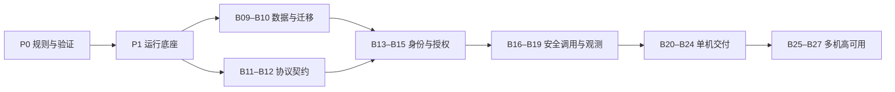

# 后端服务架构实施任务

状态：2026-09-27，P0–P3（B01–B19）已实现；P4–P5 与按需扩展待实施。数据与身份基础完成不表示通过生产基线验收。
工程契约见 [P0 工程契约](backend-service-engineering-contract.md)，验证范围与证据见 [P0 验证记录](backend-service-p0-verification.md)。

依据：[后端服务整体架构](backend-service-architecture.md)、[Web Service](web-service-architecture.md)、
[Micro Service](micro-service-architecture.md)。本文是执行清单；架构边界变更须同步更新上述文档。
不绑定发布版本、工期或具体负责人；开始执行时再根据任务体量分配。

## 1. 实施边界和现状

- `web-service` 面向终端用户：Go + Gin、REST/JSON、OpenAPI、OIDC、浏览器服务端会话、移动端访问令牌。
- `micro-service` 面向服务：Go + gRPC、Protobuf/Buf、mTLS 工作负载身份、方法级授权。
- 两者都能独立生成、通过 Docker 开发和测试、构建运行镜像、通过 Compose 单机部署。
- 多机高可用作为独立交付阶段，沿用 Kubernetes + 托管 PostgreSQL 参考，不阻塞单机版。
- 不实现待办、订单、库存或租户业务；验证所需的最小技术 fixture 只验证协议、身份、数据和故障行为。
- 不要求 Web 必须依赖 Micro 才能启动，也不要求无状态 Micro 配置数据库。

| 已有基础 | 本轮处理 |
| --- | --- |
| Docker 开发/运行镜像、Make 命令、worktree 隔离 | 复用并统一；补开发/生产配置隔离和运行约束 |
| 基础健康检查、超时、退出处理 | 补启动失败清理、依赖就绪策略、排空和故障验证 |
| Web 内存示例、Micro Ping RPC | 过渡为最小技术验证入口；不把示例业务当作生产能力 |
| 数据库/Redis 配置、局部遥测和 Buf 配置 | 接入真实能力；分开数据库与缓存角色，补端到端证据 |
| starter 构建记录与成熟度元数据 | 保留历史含义；逐项取得新证据后再更新能力声明 |

## 2. 阶段与完成关卡

B01–B19 已完成，其余任务状态为“待办”。完成必须附对应生成项目的验证证据；不能只勾选模板源文件修改。

| 阶段 | 任务 | 阶段完成条件 |
| --- | --- | --- |
| P0：规则与验证骨架 | B01–B03 | 范围、配置模型和选型有记录；可以持续生成并验证两个项目 |
| P1：公共运行底座 | B04–B08 | Docker 启动、配置失败、请求限制、健康与退出均有验证 |
| P2：协议、身份与数据 | B09–B15 | 两种入口有真实认证授权；数据库、迁移、会话可用 |
| P3：调用与可观测性 | B16–B19 | 独立生成的 Web/Micro 安全互调；故障有界且可观测 |
| P4：单机生产交付 | B20–B24 | 镜像交付、Compose 部署、发布回退和数据恢复通过演练 |
| P5：多机高可用参考 | B25–B27 | Kustomize 与平台配置契约齐备；有条件的真实环境演练 |
| E：按需扩展 | E01–E14 | 选中组件按各自契约验收，不计入默认基线完成条件 |

阶段是验收分组，不要求组内串行。主要依赖如下：

## 3. 默认基线任务

每项都应能形成独立可评审的改动。较大任务可拆多个 PR，但只有全部验收满足才完成该任务。

### P0：规则与验证骨架

#### B01 — 固定工程契约与未定选型

状态：已完成（P0 范围）。

- **依赖**：无。
- **交付**：目录职责、依赖方向、两模板能力矩阵；选定迁移工具、单一参考反向代理、本地测试 IdP 和本地证书生成方案；固定兼容的工具/依赖版本。
- **验收**：选型记录说明理由、升级和替换边界；应用不依赖 BiucingCLI 运行；数据库、缓存、代理和遥测后端的责任清楚；不引入大型共享框架。

#### B02 — 重构生成配置与兼容契约

状态：已完成（P0 范围）。

- **依赖**：B01。
- **交付**：将 `dependency_store` 的数据库/缓存混合语义拆开；定义必需、可选组件及合法组合；同步规则、metadata、CLI 展示、配置文档和 golden。
- **验收**：Web 默认具备 PostgreSQL 会话所需配置；无状态 Micro 不因数据库缺席而失败；非法组合有明确错误；旧配置如何处理有明确说明；公开模板名保持 `micro-service`，不恢复 `microservice` 别名。

#### B03 — 建立生成项目的持续验证骨架

状态：已完成（P0 范围）。

- **依赖**：B01。
- **交付**：两模板的生成→Docker 验证脚本、生成项目 CI 初始流程、证据记录格式；后续任务持续向此流程追加检查。
- **验收**：干净临时目录中生成两个项目并运行现有检查；包含非默认项目名/module/proto package；CLI 渲染、打包资源与生成项目检查分开报告；宿主机不依赖 Go 工具链。

### P1：公共运行底座

状态：已完成。实现边界与 Docker、worktree、配置和请求管线的验收证据见 [P1 验证记录](backend-service-p1-verification.md)。

#### B04 — 统一 Docker 开发工作流

- **依赖**：B02、B03。
- **交付**：`Dockerfile.dev`、运行 `Dockerfile`、`compose.yaml`、`compose.dev.yaml`；明确 `bootstrap/dev/verify/image/migrate/up/down/logs/doctor` 命令语义与旧命令迁移方式。
- **验收**：仅 Docker + Compose + Git 即可开发、测试、构建；两 worktree 同时运行不共享端口、数据卷或可变构建资源；普通 `down` 保留数据；破坏性清理有独立显式命令；文件权限与热更新可用。

#### B05 — 类型化配置、密钥与启动组装

- **依赖**：B04。
- **交付**：配置覆盖优先级、校验、文件密钥读取、脱敏诊断；显式依赖组装、启动顺序、失败清理、构建版本信息；轮换/重启契约。
- **验收**：非法配置在对外就绪前失败；部分启动失败能释放已创建资源；日志不含密码、令牌或私钥；环境变量与 `_FILE` 冲突行为确定；开发凭据不能静默进入生产配置。

#### B06 — 公共请求处理管线

- **依赖**：B05。
- **交付**：HTTP middleware、gRPC unary/stream interceptor：请求 ID、恢复、校验、消息大小限制、超时与取消、并发限制；Principal 和授权策略接口。
- **验收**：错误、panic、超限和客户端取消行为可预测；默认拒绝未显式公开的受保护入口；请求 ID 输入受约束；流式调用不能绕过身份和资源限制。身份验证器由 B13–B15 接入。

#### B07 — 健康检查、运维入口与退出

- **依赖**：B05、B06。
- **交付**：live/ready、gRPC health、启动状态、独立管理端口；就绪依赖分类；SIGTERM 排空、有限等待和强制退出路径。
- **验收**：排空先停止接收新流量；在途请求在预算内完成或终止；数据库失败不会直接把存活检查变成重启循环；可选遥测故障不阻止服务就绪；诊断、版本、指标不默认公网暴露；reflection/pprof 默认关闭或受保护。

#### B08 — 结构化日志与安全审计接口

- **依赖**：B05、B06。
- **交付**：`slog` JSON 输出、级别、请求/调用关联字段、敏感信息处理；身份/权限/配置变更等安全事件接口，明确留存由平台负责。
- **验收**：异常可关联请求且不输出内部堆栈给用户；请求体、Cookie、Authorization 不默认记录；测试日志脱敏；高频日志有采样或限速策略；安全审计与调试日志区分。

### P2：协议、身份与数据

状态：已完成。实现选择、限制、真实 Docker/数据库/身份验证和协议破坏测试见 [P2 验证记录](backend-service-p2-verification.md)。

#### B09 — PostgreSQL 接入与数据边界

- **依赖**：B05、B03。
- **交付**：pgx pool、事务辅助、查询超时、连接预算配置、TLS、运行账户最小权限；真实 PG 集成测试工具。
- **验收**：回滚、取消、连接耗尽和断线恢复有测试；连接总量与实例数的计算方式有文档；两服务使用独立数据库/角色，无法跨服务访问表；不强制无状态 Micro 初始化 pool。

#### B10 — 独立迁移与兼容性检查

- **依赖**：B09。
- **交付**：版本化 SQL、独立迁移入口/容器、互斥与失败恢复流程、schema 兼容检查；区分迁移与运行凭据。
- **验收**：空库初始化、已有库升级、并发迁移、失败迁移均有验证；服务副本不自行抢跑迁移；流水线执行一次迁移后再发布；采用扩展→迁移→收缩策略，破坏性 schema 变更不与旧版本共存；应用回退不假定数据库可逆。

#### B11 — Web HTTP 契约

- **依赖**：B06、B03。
- **交付**：OpenAPI、统一错误体、状态码、版本兼容策略；请求/响应校验、分页/幂等/并发控制的扩展约定；公开与受保护路由分类。
- **验收**：生成接口与契约一致；错误不泄漏内部信息；契约破坏有 CI 检测；不为每个接口强制套用分页、幂等或乐观锁；只保留最小协议测试 fixture。

#### B12 — Micro RPC 契约

- **依赖**：B06、B03。
- **交付**：Protobuf 包与版本规则、Buf lint/breaking、可重复代码生成、gRPC status/details 映射和消费方式。
- **验收**：不兼容变更能被阻止；breaking 比较真实基线而非空比较；未知/非法字段与请求边界策略明确；消费者无须导入服务端内部包；生成代码可重复且版本固定。

#### B13 — Web OIDC 与移动端令牌

- **依赖**：B11、B05、B08。
- **交付**：外部 OIDC 接入、授权码与 PKCE、state/nonce、回调白名单、JWKS 缓存与刷新；移动端 access token 验证；Compose 开发测试 IdP。
- **验收**：校验 issuer/audience/签名/有效期及令牌用途，ID token 不能当 API access token；过期/错误签名/未知 issuer 被拒绝；IdP 暂时故障时，仅仍可本地验证的有效凭据继续使用；未知密钥不能放行；开发 IdP 不出现在生产默认部署。

#### B14 — 浏览器 PostgreSQL 会话与入口防护

- **依赖**：B09、B10、B13。
- **交付**：不透明会话 ID、服务端会话表、Cookie 策略、会话轮换/注销/过期清理、CSRF 和精确 CORS；敏感令牌的存储与轮换方案。
- **验收**：浏览器不获得服务端持有的 refresh token；多实例共享会话；注销和到期生效；登录固定攻击、跨站写入、并发刷新均有测试；有效会话在 IdP 短故障期间遵循明确期限，不能无限续期；后台清理不依赖每个 API 副本重复调度。

#### B15 — Micro mTLS、方法授权与用户上下文

- **依赖**：B12、B05、B08。
- **交付**：双向证书验证、工作负载身份映射、方法 allowlist、证书/信任根轮换；受信调用方的用户上下文格式与转发规则；本地测试 CA。
- **验收**：无证书、错误身份、过期证书和未授权方法被拒绝；服务身份从验证后的证书取得；只有获准服务可以声明用户上下文，校验来源、大小和格式；终端注入的同名字段被剥离；多跳转发需重新授权；纯服务调用不强制伪造用户身份；私钥不提交仓库。

### P3：调用与可观测性

状态：已完成。客户端、预算、观测实现及独立项目互调与故障验证见 [P3 验证记录](backend-service-p3-verification.md)。

#### B16 — 出站 HTTP/gRPC 客户端

- **依赖**：B05、B12、B15。
- **交付**：客户端构造/释放、连接复用、TLS/mTLS、服务地址配置、DNS/负载均衡策略、证书轮换、身份上下文传播。
- **验收**：两模板都可作为调用方；对端证书和服务身份匹配；不默认转发用户 Cookie/Authorization；地址变化、连接中断后可以恢复；不逐请求创建连接；服务消费者和服务端可独立升级。

#### B17 — 调用可靠性与资源预算

- **依赖**：B16、B06。
- **交付**：端到端 deadline 与子调用预算、取消传递、有限退避和 jitter、按操作声明的重试策略、按依赖并发隔离、背压与熔断扩展点；区分进程限流与全局限流。
- **验收**：超时不等于下游未执行；非幂等操作不能自动重试；重试只在指定层执行且受总预算限制；慢依赖不耗尽全局线程/连接/协程资源；恢复后不会瞬间放大请求；错误、拒绝与降级可区分。

#### B18 — 指标、追踪与运维观测

- **依赖**：B07、B08、B09、B16。
- **交付**：OTel HTTP/gRPC/DB 仪表化、统一资源字段与传播；延迟/错误/流量/饱和度指标、连接池和重试指标；Collector 配置与可选本地查看栈、告警示例。
- **验收**：Web→Micro 可关联 trace 与日志；用户 ID/URL 参数不成为高基数指标标签；导出队列、采样、超时有界；遥测后端不可用不拖垮请求；明确 Collector 不负责长期存储，留存/告警目标由部署方配置。

#### B19 — 两个独立生成项目的互调验证

- **依赖**：B10–B18。
- **交付**：仓库级集成 harness，分别生成 Web 与 Micro，用技术 fixture 验证终端身份→Web→mTLS RPC→Micro；独立镜像、配置和数据库权限。
- **验收**：覆盖成功、无用户/无服务权限、伪造上下文、对端超时、取消、证书轮换、下游重启、IdP 短故障；每个项目单独运行仍正常；验证辅助入口不成为默认公开生产 API。

### P4：单机生产交付

状态：已完成（模板交付与本机验收范围）。生产 Compose、供应链、发布/回退、隔离备份恢复、安装包和回归证据见 [P4 验证记录](backend-service-p4-verification.md)。GitHub OIDC/GHCR 实际发布、远端灾难恢复及多机高可用另按目标平台验收。

#### B20 — 生产镜像与 Compose 拓扑

- **依赖**：B04–B07、B10、B14、B15、B18。
- **交付**：`compose.prod.yaml`、选定反向代理、TLS/路由/密钥挂载、网络隔离、资源预算；镜像 digest 部署、多阶段构建、非 root、最小权限、只读文件系统及必要 tmpfs。
- **验收**：生产只拉取镜像，不现场构建或挂载源码；仅代理公开必要端口；DB/RPC/admin 不默认公网发布；有日志轮转、restart 与停止宽限；明确 unhealthy 不会自动重启或自动从代理摘流，故障处理有实际验证；开发与生产 compose 组合方式固定。

#### B21 — CI 与镜像供应链交付

- **依赖**：B03、B19、B20。
- **交付**：完整生成项目 CI：格式/静态检查→测试→真实依赖/契约/迁移→镜像→扫描/SBOM/来源证明/签名→非 root smoke；发布流水线与部署前 digest/签名验证步骤。
- **验收**：失败阻止发布；镜像扫描有例外和修复规则；密钥不进入构建层/日志；构建与发布权限隔离；本地构建不要求持有生产发布凭据；记录实际验证平台，未验证平台不宣称支持。

#### B22 — 发布、迁移、回退与运行手册

- **依赖**：B10、B20、B21。
- **交付**：首次上线、更新、配置/证书轮换、迁移互斥、版本检查、回退和排障 runbook；单机更新的停机或切流策略。
- **验收**：坏镜像、未就绪实例、迁移失败均有停止发布路径；可回退到兼容的旧应用镜像；单机中断窗口如实记录；不宣称 Compose 自动提供滚动零停机；密钥文件宿主权限和轮换责任明确。

#### B23 — 备份恢复与单机故障演练

- **依赖**：B20、B22、B18。
- **交付**：PG 备份/恢复契约与脚本入口、独立故障域存储要求；进程/容器重启、PG 断连、磁盘容量不足、慢依赖、遥测中断演练；恢复操作记录模板。
- **验收**：从备份在隔离环境真实恢复并验证数据；volume 不等同备份；记录恢复耗时和可恢复数据点，再讨论目标值；容器重建保留状态；宿主机失效的单机能力边界明确；演练不默认针对真实生产执行。

#### B24 — 模板发布验收与文档收口

- **依赖**：B19、B21–B23。
- **交付**：更新 verification matrix、release checklist、生成 README、模板 metadata 和两套架构 profile；安装包中两个模板的完整验证。
- **验收**：从构建的 wheel/sdist 生成新项目，完成 Docker 开发与单机部署检查；变量组合、golden、资源打包及 worktree 回归通过；文档步骤可复现；能力声明引用证据，不能凭旧 starter 的 `validated` 标签宣布新基线完成。

### P5：多机高可用参考

#### B25 — Kubernetes/Kustomize 与平台契约

- **依赖**：B24。
- **交付**：基础清单和示例 overlay：Deployment、Service、探针、资源预算、分散调度、发布策略、PDB、NetworkPolicy 与 Secret 引用；入口、工作负载证书、DNS、监控和托管 PG 配置契约。
- **验收**：同一 OCI 镜像从 Compose 迁移无需改应用代码；不提交真实 Secret；列出网络插件/证书系统等前提；本地结构检查与真实集群验证分开记录；不额外实施 Swarm。

#### B26 — 集群发布与容量/故障预算

- **依赖**：B25。
- **交付**：迁移 Job/流水线依赖、滚动发布/回退、扩缩容条件、实例与数据库连接预算、跨节点/可用区容量策略、托管 PG 故障切换操作契约。
- **验收**：副本变动不耗尽数据库；排空与探针/入口行为一致；节点维护与非自愿故障区分，PDB 不被当作故障保证；若缺少真实集群或托管数据库，只标记清单验证，不声称 HA 已验收。

#### B27 — 高可用场景验收

- **依赖**：B26、B23。
- **交付**：节点/可用区故障、数据库切换、证书轮换、错误发布、恢复演练报告；根据观测结果提出可用性和恢复目标。
- **验收**：记录流量、错误、恢复时间、数据一致性及人工操作；结果说明设施前提和剩余单点；未具备演练环境则保持待办，不以 YAML 渲染成功替代真实故障证据。

## 4. 按需扩展任务目录

这些任务默认不启用。B02 只预留清楚的配置模型，不提前生成空实现或大量无用抽象。
每项启动时补充一份小型决策记录：使用场景、选定实现、应用/基础设施责任、配置、故障行为、升级与移除办法。
通用完成要求：独立启停、有 Docker 开发环境、生产配置契约、观测、权限控制和真实集成测试。

| ID | 任务与交付 | 前置依赖 | 关键验收 |
| --- | --- | --- | --- |
| E01 | Redis 缓存与共享配额适配 | B02、B17、B18 | TTL/失效/击穿保护；缓存故障策略；需要全局限流时验证多实例一致性，不能以进程计数冒充 |
| E02 | 消息传输与事件契约 | B12、B17、B18；需要 outbox 时 B09–B10 | 发布确认、ack、重复/乱序、重试、积压、死信、人工重放；不承诺天然 exactly-once |
| E03 | 持久后台任务与独立 worker | B07、B09–B10、B18；若用 broker 则 E02 | 领取/租约/续租/取消/崩溃恢复；任务执行可重复；与现有 `worker` 模板职责对齐 |
| E04 | 定时调度与独立 scheduler | E03 | 时区、漏跑、补跑、重复触发；多实例不造成无约束重复执行 |
| E05 | S3 兼容对象存储 | B16–B18 | 授权、大小/类型、安全扫描接入、短期 URL、清理；对象与数据库不一致可处理 |
| E06 | 搜索服务适配 | B09、B18；异步同步时 E02 | 权威数据归属、索引延迟、失败重试、全量重建与切换 |
| E07 | WebSocket/SSE/业务 RPC streaming | B14–B18、B20 | 认证续期、连接限额、背压、断线恢复、代理配置、有限排空 |
| E08 | 入站/出站 webhook | B16–B18；可靠投递时 E03 | 签名、重放防护、SSRF 防护、超时、投递重试与记录 |
| E09 | 邮件/SMS/推送 provider 接口 | B16–B18；可靠发送时 E03 | 配额、凭据隔离、重复发送策略、回执与隐私；开发不真实发送 |
| E10 | 分布式协调工具 | B09 或 E01、B17 | 优先唯一约束/事务；必要锁具备租约和 fencing；旧持有者不能继续产生有效写入 |
| E11 | 分页/幂等/版本控制辅助 | B09–B11 | 稳定游标、作用域和过期；幂等请求指纹、并发重复请求、结果保留；版本冲突可预测 |
| E12 | 动态配置与 feature flags | B05、B08、B18 | 版本、审计、最后有效值、失联回退；避免请求依赖远程配置实时可用 |
| E13 | 集中策略/多租户上下文/审计后端接口 | B13–B15、B18 | 仅定义可信上下文和策略集成边界；隔离、防伪造、故障默认拒绝；不预设业务租户表/角色 |
| E14 | 网关/mesh/CDN/WAF/DDoS 平台集成 | B20；集群方案需 B25 | 可信代理链、证书终止位置、身份传递、重复重试/限流责任、绕过入口的防护；平台能力有实际配置证据 |

## 5. 每项任务共同的完成标准

1. 修改模板源文件，并在全新目录中生成受影响项目；禁止只手工修生成结果。
2. 验证与本项风险对应的正常、失败和恢复路径；涉及协议/数据库/证书时使用真实集成环境，不用 mock 代替关键证据。
3. 保持 Docker 标准流程和 worktree 隔离；涉及生成配置/路径/资源时更新 CLI 校验、golden 和打包测试。
4. 更新生成项目说明、配置说明、运行命令和证据；未验证的平台/环境明确标记。
5. 不提交密钥，不增加未启用组件的启动依赖，不引入业务模型。
6. 状态记录包含：任务 ID、PR/提交、验证命令、环境/镜像版本、结果、剩余限制。文档完成与运行验证完成分别记录。

## 6. 推荐的第一批实施顺序

| 批次 | 范围 | 评审重点 |
| --- | --- | --- |
| 1 | B01 | 固定未定选型和工程边界，避免后续每个任务重复决策 |
| 2 | B02 | 生成配置与兼容行为，特别是数据库/缓存分离 |
| 3 | B03 | 建立可复用的生成与验证入口，先让现有基线持续通过 |
| 4 | B04 | Docker 命令、开发配置、worktree 回归 |
| 5 | B05 | 配置、启动、密钥与清理；后续能力的组装基础 |

P4 已完成模板交付与本机验收；下一阶段推进 B25–B27，多机高可用清单、平台契约、容量预算与真实故障演练。
共享代码先保持两模板职责一致，通过公共测试契约防止漂移；发现稳定重复后再单独提取小型版本化库，
不把抽象共享框架设为开工前提。默认基线以 B24 为单机交付关卡，B27 为多机高可用关卡。
