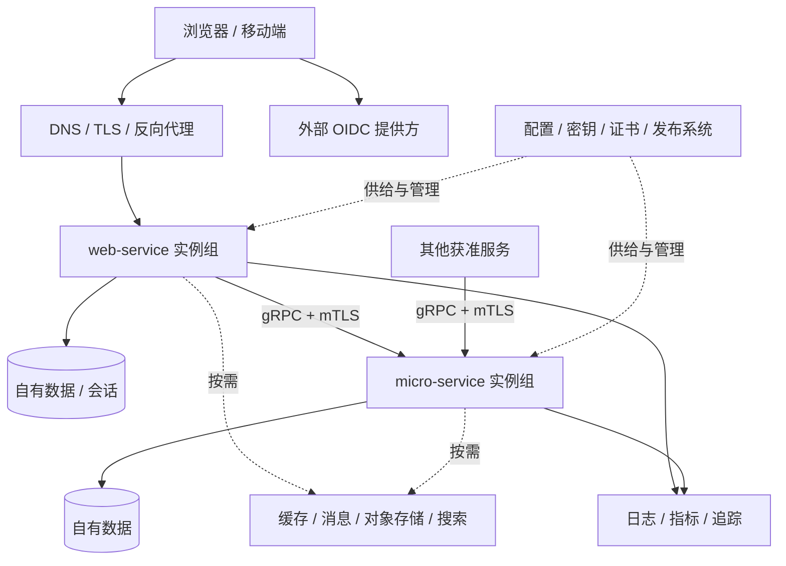

<a id="后端服务整体架构"></a>
# Backend service architecture

[中文](architecture.md) · Translation of the Chinese primary document.

Status recorded on 2026-09-27: architecture approved; P0–P3 implemented and accepted, with P4/P5 still target architecture at that time. Actual call/observability boundaries are in [P3 validation](../../initiatives/feature/backend-services/p3-validation.en.md); this does not establish production delivery or HA acceptance. P0 choices, configuration and verification entrypoints are in [engineering contracts](contracts.en.md). Order, dependencies and acceptance live in [implementation tasks](../../initiatives/feature/backend-services/plan.en.md).

This is the common baseline for both backend templates. Entrypoints are detailed in [Web Service](web-service.en.md) and [Micro Service](micro-service.en.md). This work does not define business models, example state machines or domain decomposition.

<a id="1-目标与已定边界"></a>
## 1. Goals and agreed boundaries

- web-service serves browsers/mobile users through public HTTP APIs and user identity.
- micro-service serves other services through internal contracts and workload identity.
- Both are independent Go services that can run, test, deploy, scale and be maintained separately, with the same production-quality standard.
- Docker provides development tools, test environments and runtime images; Compose supports local development and single-host production.
- PostgreSQL is the default persistence integration. Existing OIDC, server-side browser sessions and internal gRPC/mTLS remain the direction.
- Both caller and server own synchronous calls; Web may also be a gRPC client.
- HA is accepted against real failure scenarios. Kubernetes/managed PostgreSQL remain multi-host references, not prerequisites for development or single-host deployment, and consume Docker-built OCI images.
- Previously discussed todo, order, inventory and personal/organization resource models are not generic architecture decisions.

Complete common components means clear integration, ownership and acceptance when needed, not running every middleware in every project. The following are recommended baseline choices; exact dependencies are pinned and verified during implementation.

<a id="2-系统拓扑与责任"></a>
## 2. Topology and responsibilities



One template creates one independent service, not an entire platform or dependent fleet. A service may contain multiple internal modules; protocol role determines neither data ownership nor module count. Internal contractual calls are allowed, avoiding cycles, unbounded fan-out and deep synchronous chains.

| Layer | Provides | Responsibilities outside the service process |
| --- | --- | --- |
| Application | Protocol, security, authorization entry, data adapters, outbound calls, lifecycle, telemetry | Scheduling, certificate issuance, backup facilities |
| Proxy/ingress | TLS, routing, connection/request limits, traffic switching | Final resource authorization and business transactions |
| Data/middleware | Persistence, message delivery, caching/object storage | Application permissions and consistency policy |
| Operations platform | Registry, config/secrets, certificates, orchestration, log retention, alerts, backup/restore | Internal application rules |

<a id="3-默认组件每个生成项目都需要具备"></a>
## 3. Default components required in every generated project

Default integration capability does not mean the template creates external facilities.

| Component | Common responsibility | Web entry | Micro entry |
| --- | --- | --- | --- |
| Startup/composition | Explicit dependencies, initialization order, failure cleanup, build info | HTTP composition | gRPC composition |
| Configuration | Typed values, validation, precedence, redaction | Domains, CORS, OIDC, sessions | RPC listener, peer identity, certificates |
| Secrets/certificates | Mounted files/secret service, permissions, rotation | OIDC credentials, session keys | Client/server certificates, trust roots |
| Inbound protocol | Routing/registration, size/time limits, cancellation, validation | Gin REST/JSON, OpenAPI | grpc-go Protobuf, Buf |
| Request pipeline | Request ID, trace, logs, recovery, auth, limits, metrics | Middleware | Unary/stream interceptors |
| Authentication | Verified credentials become explicit Principal | OIDC, browser sessions, mobile access token | mTLS workload identity |
| Authorization | Default deny, explicit policy entry, audit hooks | User/resource scope defined by project | Caller/method permissions and optional user context |
| Errors/contracts | Typed errors, stable codes, versions/compatibility | HTTP status/public body | gRPC status/controlled details |
| Persistence | PostgreSQL pool, transactions, connection budget, query timeouts | Sessions require DB; optional application data | Optional per service |
| Migration | Separate command, versions, exclusion, compatibility | Shared rules | Shared rules |
| Outbound clients | HTTP/gRPC lifecycle, reuse, TLS, DNS, budgets | Internal services/external APIs | Other services/external APIs |
| Reliability | Deadlines, concurrency, backpressure, retry policy, isolation | Public response/degradation per contract | Safe retry conditions per RPC |
| Health/lifecycle | Live/ready, startup, SIGTERM, bounded drain | HTTP probes | gRPC health/private HTTP admin |
| Observability | JSON logs, metrics, traces, resource attributes, redaction | HTTP | RPC |
| Operations | Build version, diagnostics, config checks, runbook | Outside public user routes | Outside business RPC |
| Containers | Dev/runtime, Compose, resource limits, health, signals | Only ingress publishes public ports | Business RPC internal by default |
| Quality/delivery | Unit/contract/integration, image verification, scans, CI | Public API/login | Contracts, workload identity, client consumption |

Keep Go/Gin/grpc-go, standard-library slog and OpenTelemetry. Prefer pgx for PostgreSQL and mature versioned SQL migration tools; SQL generation is optional and ORM not required. These are library choices, not promises about unverified version combinations. Both templates share Go versions and common dependency upgrade cadence.

<a id="4-按需组件定义接入规范启用时交付完整能力"></a>
## 4. Optional components with complete operational integration

| Component | When enabled | Issues that must be addressed |
| --- | --- | --- |
| Redis/cache | Repeated reads, short shared state, shared rate limits | TTL, invalidation, stampede, capacity, whether failure can bypass cache |
| Broker | Events, multiple consumers, async calls, burst smoothing | Version/auth/ack/redelivery/dedup/backlog/dead-letter/replay; evaluate outbox for dual writes |
| Background jobs | Reliable work after response | Persistence, retries, cancellation, concurrency, lease/claim, recovery; independent worker container |
| Scheduling | Periodic maintenance/batches | Timezones, missed/catch-up runs, duplicates, idempotency; separate scheduler/executor |
| Object storage | Files/large objects | S3 adapters, size/type limits, temporary URLs, access, cleanup, upload security |
| Search | PostgreSQL cannot meet retrieval requirements | Index build, lag, rebuild, authoritative data location |
| WebSocket/SSE/RPC streams | Bidirectional/realtime/long streams | Auth renewal, backpressure, proxy timeout, drain, reconnect |
| Webhooks | External callback delivery/receipt | Signatures, replay defense, outbound restrictions, retries, dedup |
| Email/SMS/push | Notifications | Provider adapters, credentials, quotas, timeouts, retries, delivery tracing |
| Distributed coordination | Cross-instance exclusion | Prefer unique constraints/transactions; locks need lease, expiry, fencing and do not replace consistency |
| Idempotency/pagination/version concurrency | APIs have corresponding semantics | Shared conventions/helpers, resource-specific policy; not blanket wrappers |
| Dynamic config/flags | Behavior changes between deployments | Versions, audit, rollback, cache, last-valid config on platform loss |
| Central policy/multitenancy/fine audit | Permissions/compliance needs | Identity/tenant sources, isolation, policy versions, retention/access |
| Mesh/API gateway | Operational scale warrants it | Avoid duplicate retries/limits; define certificate, policy, telemetry, upgrade ownership |
| CDN/WAF/DDoS | Public traffic/threat needs | Edge facilities, proxy trust, origin restrictions, bypass paths |

Redis, brokers, search and object storage are distinct capabilities, not interchangeable dependency_store choices. Integrate through explicit adapters/configuration; do not prebuild a universal plugin container or empty generic Repository.

<a id="5-代码内部分层与共享方式"></a>
## 5. Internal layers and sharing

```text
cmd/server          服务入口与显式组装
cmd/migrate         单次迁移入口（启用持久化时）
internal/transport  HTTP 或 gRPC 适配、middleware/interceptor
internal/app        应用模块与用例扩展位置
internal/platform   config、identity、telemetry、runtime、health
internal/adapter    postgres、httpclient、grpcclient；按需扩展其他适配器
api                 OpenAPI 或 proto/Buf 契约
migrations          版本化 SQL
configs             非敏感默认配置与配置说明
scripts             Docker 工作流及检查脚本
```

Requests flow transport → app → data/remote interfaces. Adapters implement interfaces, and the entrypoint composes them. HTTP/gRPC/SQL/exporter concrete types remain at adapter boundaries. Define interfaces only for real replacement, testing or isolation.

Initially share standards, container workflows and contract tests. Extract small versioned Go packages only after common code stabilizes and repeats. Generated projects pin versions; avoid dependence on CLI source, global containers or a framework forcing all projects to upgrade together.

<a id="6-身份协议与跨服务协作"></a>
## 6. Identity, protocols and service collaboration

Web uses external OIDC: server-side browser sessions and mobile access tokens. PostgreSQL shares sessions across replicas. Login/logout/expiry/CSRF/CORS/local test IdP belong to Web. Production must not fall back to anonymous. During provider failures, serve only within valid-session/trusted-cache verification conditions.

Micro uses mTLS workload identity; authorization checks caller service and RPC method. Web is also a workload when calling RPC. User context is accepted only from explicitly allowed callers, while receivers still authorize their own resources. Record machine and user identities separately; trace baggage is not an authorization credential.

Certificates need short validity, peer matching, trust-root updates and tested rotation. Development uses local test CA; production supplies files or workload identity. Compose must still assign issuance/update responsibilities; a shared network is not an authentication exemption. Application mTLS is the default option; mesh is a later deployment choice.

Declare each outbound dependency's address, identity, connection/request timeouts, concurrency budget and retry conditions centrally. Support external HTTP and internal gRPC. Use service DNS/discovery, not fixed container IPs; reuse connections and reconnect after replacement. Verify gRPC multi-replica distribution: replicas or one VIP do not ensure equal RPC distribution. Choose client balancing or HTTP/2 proxy for the discovery model and test removal/reconnect.

Propagate deadlines/cancellation. Retry only safe operations within total budgets, never layered unbounded retries. Circuit-breaking/degradation hooks are per dependency; concurrency limits and fast rejection are defaults. Ingress rate limits, process resource limits and cross-replica user quotas are distinct; local counters are not global quotas. APIs own compatibility: OpenAPI/Buf checks, pinned consumer contracts, compatible upgrade windows. User-controlled outbound HTTP requires SSRF defense, destination/redirect checks and egress restrictions. Forwarded headers are trusted only from configured proxies. Credentials use least privilege and executable rotation verification.

<a id="7-数据状态与后台运行"></a>
## 7. Data, state and background execution

Services own data/migration permissions. Physical PostgreSQL clusters may be shared but databases/roles/permissions remain separate; physical sharing couples capacity/failures. No cross-service table access. Sum connection budgets across all replicas.

One-shot container/release tasks execute migrations with exclusion/failure blocking; replicas only check compatibility. Separate runtime and migration accounts. Migrations must coexist with old versions; image rollback is not data rollback. Assign TLS, backups, restore exercises, retention/deletion; volumes are persistence, not backups.

API containers are replaceable: recoverable sessions/jobs cannot depend on process memory or writable layers. Stateless Micro need not start a DB; do not invent dependencies for uniformity. Enable jobs through a separate worker entry/mode/container in the same repository with independent scaling; deploy scheduling separately, not once per API replica. Choose persistence, messaging and cross-service consistency technology when demanded, not as mandatory runtime dependencies of a business-free template.

<a id="8-生命周期健康与可观测性"></a>
## 8. Lifecycle, health and observability

Startup: validate config/secrets → initialize required components → check schema → register routes/services → ready. Fail with bounded cleanup. Shutdown: withdraw ready → stop claiming work → bounded drain → close pools/telemetry. Application drain must fit container grace; the process directly receives SIGTERM.

- /livez reflects process health; DB/telemetry failure does not directly imply death.
- /readyz checks core necessities, not recursively all optional downstreams, avoiding whole-chain removal.
- Micro also provides gRPC health and a separate HTTP admin listener.
- Versions, metrics, pprof, reflection and config diagnostics have explicit exposure policies; debugging is not public by default.

JSON logs go to stdout/stderr. Metrics cover requests/errors/latency/resources/pools/downstreams; traces cover HTTP/gRPC/DB. Collector is optional forwarding, not query or long-term storage; connect a real backend per environment. Retention/rotation, bounded queues/sampling/export memory are required. Telemetry failure must not block requests; drops are observable. Audit and diagnostic logs have separate content/access/retention rules. Tokens, cookies, keys and full bodies are not collected by default.

<a id="9-docker-开发与部署契约"></a>
## 9. Docker development and deployment contracts

<a id="91-开发"></a>
### 9.1 Development

Required host tools are Docker Engine/Desktop, Compose and Git; Go/Buf/lint/migration tools live in dev images. Optional host Go debugging remains, but acceptance does not depend on host Go/Homebrew/mise. Standard files: Dockerfile.dev, Dockerfile, compose.yaml, compose.dev.yaml, compose.prod.yaml. Production Compose stands alone, never overlays development files and inherits source mounts/debug ports.

Development supports mounts/reload/debug/cache/test PostgreSQL, Web local IdP and Micro test certificates. Observability/cache/brokers use optional profiles; required production dependencies missing at startup cause failure, not disabled features. Keep project/worktree names for ports/images/volumes/cache.

P1 provides ./scripts/task bootstrap/dev/verify/image/up/down/logs/doctor with matching Make wrappers. P2 migrate is independent; generated README records command migration. Ordinary down retains data; destructive cleanup is a separate explicit command.

<a id="92-单机生产"></a>
### 9.2 Single-host production

Reference prebuilt image digests, pull/verify, migrate, then start/update; never compile source on production hosts. Multi-stage/non-root/least privilege/read-only roots where possible/tmpfs/resource limits/restart/log rotation/health/grace form the baseline. Dependency images pin reproducible versions; CI scans, produces SBOM and maintains upgrades.

Only ingress publishes public ports. Restrict DB/RPC/telemetry/admin through private networks and host firewalls. Development dependency ports bind loopback by default. Network membership still requires application auth; network names are not identities. P4 selects Caddy with platform TLS and active readiness probes. Domains, certificates, storage paths, capacity and log/backup destinations are deployment contracts.

Environment overrides nonsecret file configuration; secrets use mounted files and _FILE conventions. Compose secrets are per-service file mounts, not encrypted vaults; operations owns host permissions, origins and rotation. DB uses persistent volumes/external service with backups in another failure domain.

Compose ordering uses health or one-shot success conditions; applications must reconnect during runtime outages. unhealthy alone neither restarts containers nor removes proxy traffic. Restart policies act on exits; ingress health routing and monitoring need configuration. Single-host updates may interrupt; interruption-free upgrades require explicit traffic-switch design.

<a id="93-多机高可用"></a>
### 9.3 Multi-host HA

Reuse OCI images/application contracts with Kubernetes/Kustomize references. Cross-node/zone replicas, redundant ingress, scheduling capacity, update strategies, certificate/secrets distribution and managed-PG failover provide multi-host capabilities. Kubernetes uses compatible runtimes for Docker-built images, not necessarily Docker Engine. Swarm requires a separate later adapter; do not maintain multiple multi-host baselines now.

Compose may suit production risk budgets, but host failure stops the stack; same-host replicas do not remove it. Middleware must satisfy matching failure goals. Establish RPO/RTO, scaling thresholds and availability percentages only after real-environment acceptance.

<a id="10-交付验证与故障基线"></a>
## 10. Delivery verification and failure baseline

Generated projects have their own CI: format/static → unit/protocol → real-dependency integration → compatibility/migration → image build/scans → non-root/container smoke → clean Compose startup/restart. Internal calls add client consumption, wrong mTLS identity rejection, rotation and deadlines; Web adds identity/session/browser security. Separate build/publication/deployment; no production credentials in builds; retain artifact/migration/config associations. Traceable provenance, signatures and deploy verification are required. Scan findings block or receive documented treatment by severity; a report alone is not supply-chain acceptance.

| Failure | Acceptance |
| --- | --- |
| Crash/update | Recover through restart/replacement, bounded drain, no old-process state dependence |
| DB outage/failover | Bounded failure/reconnect, no endless waits or liveness restart storm |
| Slow/unavailable downstream | Isolation/concurrency/budgeted retries, unrelated APIs remain usable |
| OIDC/certificate facility outage | Serve only within credential validity/trust; do not disable validation |
| Telemetry outage | Application continues, bounded buffering, diagnosable export failure |
| Host/zone loss | Single host documents interruption/recovery; multi-host verifies takeover |
| Bad release/migration | Block release, compatible rollback; real restore for damaged data |
| Data loss despite backups | Restore on independent instance, record duration/data point |

<a id="11-当前实现差距与实施顺序"></a>
## 11. Current gaps and implementation order

| Repository evidence | Remaining deployment ownership |
| --- | --- |
| Docker/worktree, P4 production Compose/Caddy, digest/least privilege | Host networking/certificates/capacity/ingress DNS |
| Config/file secrets, budgets, private admin, outbound reliability/OTel | Production telemetry retention/alerts/network controls |
| Web OIDC/PG sessions/protocol/real dependencies | Production IdP/DB accounts/backup retention/recovery targets |
| Micro mTLS/method/delegation/Buf/optional data+migration | Production workload PKI issuance/rotation/authorization |
| Scan/signature/provenance release, rollback/isolated restore | Actual GitHub OIDC/GHCR, multi-host HA, remote disaster recovery |

P0–P4 scope lives in [tasks](../../initiatives/feature/backend-services/plan.en.md) and stage records. P5 references/tools exist; B27 real exercises are next. Section 4 extensions remain demand-driven, not default startup dependencies.

<a id="12-依据"></a>
## 12. References

- [Compose production](https://docs.docker.com/compose/how-tos/production/): development/production and single-host operation.
- [Startup order](https://docs.docker.com/compose/how-tos/startup-order/): running versus ready.
- [Secrets](https://docs.docker.com/compose/how-tos/use-secrets/): file mounts/service access.
- [Networking](https://docs.docker.com/compose/how-tos/networking/): names/networks/replacement.
- gRPC [auth](https://grpc.io/docs/guides/auth/), [deadlines](https://grpc.io/docs/guides/deadlines/), [balancing](https://grpc.io/docs/guides/custom-load-balancing/): connection/request ownership.
- [Collector](https://opentelemetry.io/docs/collector/): receive/process/export.

P4 implementation/actual limits: [single-host validation](../../initiatives/feature/backend-services/p4-validation.en.md). P5 provides Kustomize, release/rollback/capacity; real node/AZ/managed-DB failover awaits B27: [P5](../../initiatives/feature/backend-services/p5-validation.en.md).
