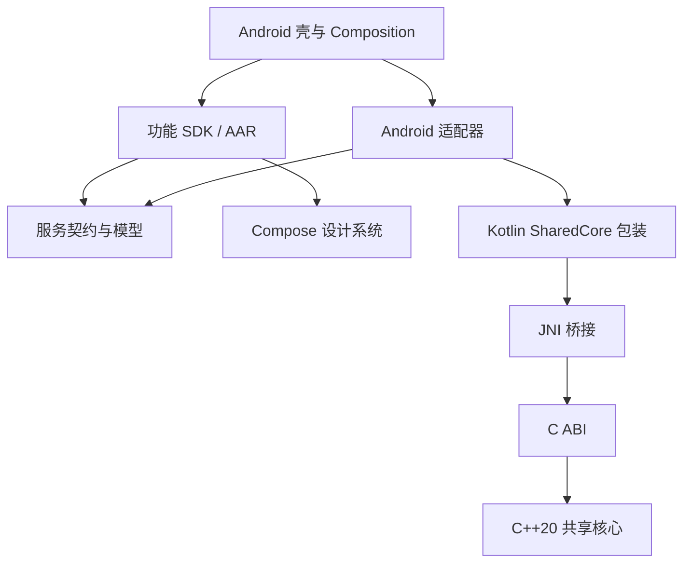

<a id="android-对齐-apple-的壳工程与组件架构"></a>
# Android shell and component architecture aligned with Apple

[中文](android.md) · Translation of the Chinese primary document.

Compiled2026-09-24. Baseline implemented; section8 local evidence, remote CI/product delivery still require acceptance. Based on Apple architecture/component-shell source/artifact scripts and Android Gradle/Kotlin source.

[Shared decisions](cross-platform-decisions.en.md) govern follow-up acceptance. ViewModel config-change retention and prior simulator tests do not prove all new lifecycle/scope cases.

<a id="1-结论与范围"></a>
## 1. Conclusions and scope

Adopt thin shells/feature components/platform adapters/C++20/compile-time DI/independent precompiled releases. Unify responsibility/direction/interop/delivery; Android equivalents use Kotlin/Compose, AAR/JAR, suitable DI, Gradle/NDK instead of SwiftUI/XCFramework/SafeDI/Tuist.

User confirmed Maven precompiled AAR for UI/resources/native, JAR possible for pure JVM contracts; Kotlin/JNI wraps shared ABI/C++20; Dagger graphs generated inside components, public factories compose shells. Implemented Dagger2.52 Java processor/NDK28.2.13676358/CMake3.22.1/armeabi-v7a+arm64-v8a+x86_64. Default phone-tablet/Wear/TV shells; section8 limits.

<a id="2-apple-当前真正采用的架构"></a>
## 2. Actual Apple architecture

[Apple baseline](apple.en.md), [evidence](../../initiatives/feature/native-components/apple-validation.en.md); read early candidate wording with Apple section14 implementation.

| Aspect | Current decision/implementation |
| --- | --- |
| Shells | Four in one repo, no parity |
| Ownership | Entry/lifecycle/navigation/public composition, features service contracts, adapters core |
| Source | Multi-Target Components/Package.swift, Shared/Core C++/ABI/Swift; repo/module/release not one-to-one |
| Binary | Three units/five modules, static XCFramework |
| DI | SafeDI2.0.0 CLI component+shell graphs; no public DI types, Swift verifies actual interfaces |
| State | Shared factory/independent window-page sessions, serial wrapper/cancel/retention/async close |
| Governance | Independent immutable versions/full locks/checksums/explicit local override, CI+Release reject |
| Business | Shared rules/state/use cases C++, UI/permissions/flows outside |

Core bounded-integer example covers sessions/errors/cancel/commit, not DB/migration/sync/progress. Four builds/tests are existing local evidence, not rerun here; full remote CI/other devices/stores remain.

<a id="3-迁移前的-android-现状与差距"></a>
## 3. Pre-migration gaps

Historical gaps; section8 results.

| Evidence | Assessment | Target |
| --- | --- | --- |
| app/core/feature with project implementation | Source modules, not binaries | Maven shells/separate components |
| MainActivity direct Home/Settings | Basic shell, no factories/outputs | Composition receives typed navigation |
| Settings creates DefaultAppEnvironmentProvider | Concrete choice in feature | Inject service, composition selects |
| core/network only environment provider | Name not network/data proof | Actual responsibilities, no empty modules |
| model/designsystem/testing/two features | Reusable base | Contracts/design/feature SDK/testing only tests |
| Catalog/wrapper hashes/verification | Supply-chain base | Full dependency locks/manifests/immutability/overrides |
| No NDK/JNI/app DI | Not integrated | SharedCore SDK/layered graphs |

Transitive Dagger entries do not prove app DI. Catalog/checksums do not replace full resolved locks.

<a id="4-apple-a01a20-决策在-android-上的对应"></a>
## 4. Mapping A01–A20

| ID | Apple principle | Android alignment |
| --- | --- | --- |
| A01 | Copies/opaque/allocator-free | Kotlin wraps handles, no exposed addresses, explicit safe close |
| A02 | Stable/per-call/no escaping exceptions | C codes→typed Kotlin, handle JNI exceptions |
| A03 | Same-handle serial | Explicit scheduling/off-main JNI, suspend not automatically background |
| A04 | Cancel/retention/wait/once | Coroutine→native token, free only after actual completion |
| A05 | UTF-8/lossless | Kotlin/JNI/C checks, lengths/unsigned ranges, Modified versus standard UTF-8 |
| A06 | Whole bounded operations | Shared use cases, avoid tiny hot JNI, cancel/commit race semantics |
| A07 | Multi-shell repo | app/wear/tv, same exact locks |
| A08 | Few packages/internal modules | Independent Gradle development, stable release boundaries |
| A09 | Shared rules/platform UI | Native Compose navigation/focus/layout per device |
| A10 | Compile-time DI/scopes | Dagger2.52 Java, app/session/feature, no global service container |
| A11 | Typed intents/shell routing | Sealed types/callbacks/stable IDs, no foreign VM/handle |
| A12 | Layered/binary tests | Core/JNI/components/Compose/shell/published consumers |
| A13 | C++ authority | Same source/ABI, no duplicate Kotlin rules |
| A14 | Data ownership | Shared formats/migrations, Android access/secure storage/permissions, demand-driven DB |
| A15 | Precompiled from start | AAR UI/resources/native, optional JVM JAR |
| A16 | Explicit overrides/prereleases | Isolated local Maven, formal no override/source substitution |
| A17 | Exact set/compatibility | Maven/Gradle locks/hashes; Kotlin/JVM/Compose/JNI/native checks |
| A18 | Scoped/default resources | AAR defaults/prefix/public-resource scope/styles-config |
| A19 | Static/one core | One controlled JNI .so incorporates static core, no per-feature copies |
| A20 | Internal graphs/public factories | Generate before publish, hidden graph, shell verifies visible deps |

<a id="5-android-的建议结构与依赖方向"></a>
## 5. Suggested structure and direction

```text
AndroidProduct/
  app/                     # 手机/平板壳
  wear/                    # 独立 Wear OS 壳
  tv/                      # Android TV 壳
  composition/             # 产品组装、公开工厂、会话与适配器
  dependencies/            # 产品组件声明、产物信息、本地覆盖配置
  gradle/                  # 版本目录、锁与校验配置（锁文件按 Gradle 布局放置）
  components/              # 可同仓开发，但使用独立组件构建入口
  shared/core/             # 共享核心接入及 Android 包装开发入口
  tests/                   # 产品级二进制集成验证
  scripts/                 # 构建组件、发布、锁定、覆盖诊断
```

Suggested, not mandatory renames. Product includes shells/composition; independent component build may use source module deps. Products still build with locks after component sources moved away.



Contracts/design/core/features are logical boundaries; Maven need not copy FoundationKit packaging. Extract shared contracts only across real release boundaries, no duplicate classes.

<a id="6-必须单独处理的-android-决策"></a>
## 6. Android-specific decisions

<a id="61-jni-与链接"></a>
### 6.1 JNI and linking

SharedCore AAR→one JNI .so→static C++ core. Core ownership/static composition shared principle; runtime still loads a shared JNI library, AAR itself not static library.

Kotlin schedules/retains/maps/closes, JNI converts/forwards without rules. JNIEnv not shared across threads; standard versus Modified UTF-8 distinguished; cross-call refs explicitly released: [JNI](https://developer.android.com/ndk/guides/jni-tips).

Canonical shared/core source synced by sync-shared-core into three self-contained templates, tested byte-identical, never maintained independently. Wrappers stay platform-specific; independent generated copies later collaborate through the same versioned authority. Apple binaries unusable directly on Android.

Pin NDK/CMake/ABIs, check symbols/runtime. One JNI library may prefer static libc++; other native SDKs require reassessing runtime/symbols/ownership, no blind static duplication across .so. General external AAR/team-controlled app separately verified: [C++ runtimes](https://developer.android.com/ndk/guides/cpp-support).

<a id="62-编译期-di"></a>
### 6.2 Compile-time DI

Dagger internal generation/public factories confirmed, same layered approach as Apple. Hilt not selected, evaluate only if lifecycle benefit warrants.

Independent component/shell compilation and missing/cycle negatives passed locally. [Dagger multi-module](https://developer.android.com/training/dependency-injection/dagger-multi-module) provides scope/layers; Java graph+processor generate constructors, Kotlin factories hide DI, no kapt/KSP. Upgrades reverify consumption/tools.

App shares factory; business/document sessions isolate core state. Scope is not destruction, still await tasks/close.

<a id="63-android-生命周期"></a>
### 6.3 Lifecycle

Define business session versus Activity/Compose. Config changes should not recreate/close retained sessions. Leaving-page cancellation depends on task ownership; app jobs not universally page scoped.

Async close rejects new tasks/cancels/waits native/frees/idempotent. Coroutine cancellation is not synchronous JNI completion; finalizers insufficient.

Process reconstruction restores stable IDs/persistent data, never handles. Cancellation/result delivery races require separate core commit versus UI-notification semantics; abandoned UI results do not imply uncommitted writes.

<a id="64-二进制发布与可复现构建"></a>
### 6.4 Binary publication and reproducibility

Maven POM/Gradle metadata preserve transitives; local integration explicit isolated repo: [publishing](https://developer.android.com/build/publish-library/upload-library). Bare AAR copying not default.

Supply-chain checks plus full locks: catalog declares versions, dependency locking stabilizes resolution, verification metadata validates bytes: [locking](https://docs.gradle.org/current/userguide/dependency_locking.html).

Manifest source revision/hash/tools/minSdk/ABI/deps/resources/native symbols. Immutable versions; formal no local/dynamic/source substitution; absent/incompatible binaries fail. Compose API/Kotlin metadata/JNI/resources/obfuscation part of contract. AAR updates require app rebuild, not hot replacement. R8 enabled/SharedCore consumer rules; compile and runtime separately accepted.

<a id="65-设备范围"></a>
### 6.5 Device scope

Default phone-tablet/Wear/TV share contracts/HomeModel-Factory/Dagger composition/core, separately published mobile Material/Wear Compose/TV Compose UI. Watch round screens/crown/swipe-back; TV remote focus/Leanback.

Wear/TV .wear/.tv IDs and separate sessions, no sync/companion communication. Minimum max(26,minSdk)/max(23,minSdk). PLATFORM=mobile|wear|tv selects build/install/test/release, default mobile; verify-all three shells.

<a id="7-实施顺序与验收标准"></a>
## 7. Implementation order and acceptance

| Stage | Work | Gate |
| --- | --- | --- |
| Core loop | Authority/NDK/CMake/JNI/Kotlin/SharedCore | Real ABI, overflow/cancel/isolated sessions/concurrent commit-close/repeated close/post-close rejection |
| Feature/DI | Contracts/constructor injection/real Home adapter/layered graphs | Fake replacement, missing/cycle fail, no hidden-source scan |
| Binary | Independent publish/Maven/exact lock/hash/override | Source-free build/single upgrades/tamper-missing/CI+Release override rejection |
| Product | Lifecycle/resources/navigation/R8/ABI/devices | Published calls/close/recovery, source symbols, CLI/template regression |

Small executable loops first, no massive feature/device expansion. Keep wrapper/worktrees/signing/release. These stages now have template entrypoints; external repos/devices extend per product.

<a id="8-已实现的模版与验收边界"></a>
## 8. Implemented template and limits

- Product settings includes app/wear/tv only; independent components build, source core/feature layout retained.
- Ten AARs: model/designsystem/network/testing/sharedcore/homestate/home/settings/wearhome/tvhome. testing only tests; all current libraries AAR, future JVM contracts may JAR.
- homestate and three shells compile separate Dagger. HomeFactory public AnalysisService; Settings explicit environment; shell HomeOutput navigation.
- SessionOwner independent graph; ViewModel config retention, onCleared stops model/initiates close, viewModelScope owns business tasks. Explicit close awaits, completion observer errors, cancelling a waiter does not cancel shared close. Kotlin copies/serializes/cancels/releases after actual native end, close awaitable/idempotent.
- components bootstrap/publish/lock/resolve/verify/info/override; immutable versions/no source fallback/hashes/POM/ABIs/resources/core ownership checks.
- Settings verifies locked SDK, Release tasks override policy; Android Studio direct builds too.
- Product+components locks/third-party hashes; SDK component locks/exclusive Maven group prevent silent replacement.
- Matching unstripped symbols per ABI, source hashes/tools; local registry, no remote account.
- test-native actual host JVM/JNI; verify-di eight invalid graphs across state+three shells; emulators published core/resources/calculation/navigation/Activity recreation.

[Local Android evidence](../../initiatives/feature/native-components/android-validation.en.md). android-components.yml added without remote results. Runnable baseline, not real business persistence/sync/progress/device performance/signing/stores. Beyond three ABIs requires matrix expansion; minSdk<21 rejected.

<a id="9-三壳实现边界"></a>
## 9. Three-shell boundaries

core/homestate keeps feature.home package, moves model/factory/internal graph so UI avoids duplicated state/mobile design deps. composition compiled per app via sourceSets, not shared runtime container. Each owner independent native session. UI emits typed output; shell routes.

Mobile retains responsive layout; new watch/TV entries do not prove all product sizes/accessibility/power/background/store assets. Ownership/DI/build coverage: [shared verification](../../initiatives/feature/native-components/cross-platform-validation.en.md).
