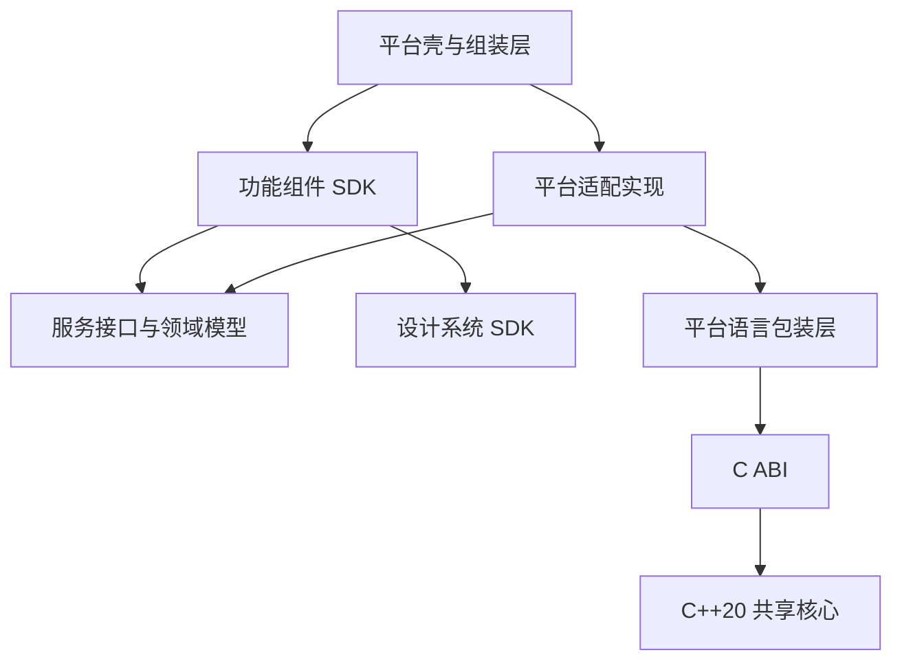

<a id="apple-四平台壳工程与组件架构"></a>
# Apple four-shell and component architecture

[中文](apple.md) · Translation of the Chinese primary document.

The baseline is implemented in the template; product-specific capabilities/external delivery require project acceptance. Compiled 2026-09-22, implementation updated 2026-09-23. Scope: Apple template/generated products.

These individually confirmed decisions form the design/technical-verification/implementation baseline. Accepted decisions do not prove implemented code or verified candidate frameworks. Directory/feature/interface names are examples, not extra requirements.

2026-09-24: [shared decisions and gaps](cross-platform-decisions.en.md) unify lifecycle, device interactions, evidence tiers and minimum DI guarantees; new requirements are not all implemented yet.

<a id="1-目标与技术基线"></a>
## 1. Goals and technical baseline

Thin shells, feature components, platform adapters and shared C++ core.

- One product repository contains iOS/macOS/watchOS/tvOS shells.
- Generate all four by default, without simultaneous launch or feature parity requirements.
- Minimum Swift6.4 toolchain, Swift6 language mode, SwiftUI.
- C++20 shared core through C ABI/platform wrappers.
- Tuist projects, SwiftPM dependencies/component development, standalone CMake core.
- Precompiled components, independently versioned by stable feature boundaries.
- Static by default; dynamic linking requires explicit need/separate verification.
- SafeDI2.0.0 CLI graph checks; integration in section14.

SWIFT_VERSION=6.0 is language mode, not compiler6.0. Source shared across Apple/Android/HarmonyOS/Windows/Linux; binaries built separately per platform/architecture/SDK, never directly reused outside Apple.

<a id="2-决策总表"></a>
## 2. Decision table

| ID | Area | Accepted decision |
| --- | --- | --- |
| A01 | Memory | Copy ordinary data, opaque state handles, allocator supplies free, zero-copy needs evidence |
| A02 | Errors | Stable codes/per-call optional diagnostics/native mapping/no cross-ABI exceptions |
| A03 | Threads | Stateless concurrent, same handle serialized/different handles parallel, wrappers schedule |
| A04 | Lifecycle | Cooperative cancel/task retention/safe close/exactly-once completion/explicit ownership |
| A05 | Format | Typed C, UTF-8+length, explicit units/nulls, lossless conversion |
| A06 | Granularity | Whole operations, light queries/bounded batches, failure/atomicity/retry semantics |
| A07 | Product | Four shells in one repository, generated by default |
| A08 | Modules | Few Packages, feature Targets inside, extract repos/packages when independent publishing matures |
| A09 | UI | Shared business/suitable state, platform UI, small controls as needed |
| A10 | DI | Compile-time checking, constructor deps/scopes/explicit close |
| A11 | Navigation | Typed intentions, shell cross-feature navigation, domain shared state, broadcasts as needed |
| A12 | Verification | Layered/component tests, deterministic previews, optional hosts, DI negatives/four builds |
| A13 | Business | Cross-platform rules/state/use cases in C++, platform flows outside |
| A14 | Persistence | Data-based ownership, shared formats/migrations, storage chosen as needed |
| A15 | Binary delivery | Precompiled from outset, independent repos, stable feature releases |
| A16 | Integration | Explicit local binary overrides, immutable prereleases, locked formal builds |
| A17 | Versions | Independent component versions/full exact locks/separate binary compatibility |
| A18 | Resources | Component defaults/design-system common/shell app resources/public customization |
| A19 | Linking | Static default, common core ownership controlled, no duplicate encapsulation |
| A20 | DI/SDK | Internal graph generated/checked, shell public deps+factories, avoid DI types in APIs |

The early source-dependency default was replaced by precompiled consumption. Products share locked artifacts; component repos still develop source.

<a id="3-壳与组件的职责"></a>
## 3. Shell and component responsibilities

| Part | Responsibility | Boundary |
| --- | --- | --- |
| Shell | Entry/lifecycle/root navigation/composition/permissions/config/signing | No business rules/DB/algorithms |
| Feature | Complete UI/state/interactions/use-case calls/internal navigation | No whole-App dependence/other component internals |
| Services/models | Collaboration capabilities/I-O/error semantics | No concrete storage SDK/views/raw pointers |
| Platform adapters | System/storage/network/core integration | No duplicate authoritative rules |
| C++ core | Algorithms/rules/domain state/state machines/shared use cases | No SwiftUI/JNI/ArkTS/app lifecycle |
| Design system | Visuals/common controls/accessibility | No business flows |

Code direction; shells/factories inject runtime implementations:



Not every service protocol needs a separate published package. Only contracts shared across release boundaries need explicit unique module ownership.

<a id="4-仓库编译模块与发布单元"></a>
## 4. Repositories, compilation modules and release units

Repository is collaboration, Target compilation, SDK delivery; no one-to-one mapping required.

Example product layout:

```text
Product/
  Apps/
    iOS/
    macOS/
    watchOS/
    tvOS/
  Composition/           # 四个平台的公开工厂组装与依赖映射
  Dependencies/          # 组件依赖声明、精确锁定与产物信息
  Tests/                 # 产品级集成验证
  Scripts/               # 依赖获取、覆盖诊断、构建与发布入口
  Workspace.swift
```

Example component repository:

```text
ComponentRepository/
  Package.swift          # 可包含多个 Target
  Sources/
  Resources/
  Tests/
  Examples/              # 按需建立调试宿主
  Scripts/               # 构建、打包、校验和发布
```

Core repository owns C++/C ABI/CMake/wrappers/tests. Components may initially share the product repository, but formal shells consume published artifacts without implicit source switching. Repo counts/names/layout determined during implementation, not many empty repos/modules.

Example release units: core/library/editor/design-system SDKs. Core, ABI and closely matched Apple wrapper release together; components may contain multiple Targets.

<a id="5-四个平台的复用边界"></a>
## 5. Four-platform reuse

- Share business rules/use cases/models/truly device-neutral state.
- Platform UI owns windows/navigation/focus/animation/selection.
- Share suitable controls, not one mandatory full View.
- Small differences use separate files; split UI Targets when differences/dependencies/isolation warrant.
- Each platform consumes necessary features; four shells do not imply parity.

Library example: iOS list/details, macOS sidebar/windows, watch recents/shortcuts, TV focus/remote browsing. These are design examples, not delivered template features.

<a id="6-c-与平台语言的六项契约"></a>
## 6. Six C++/platform contracts

<a id="61-内存所有权"></a>
### 6.1 Memory ownership

- Borrow normal inputs for the call; convert ordinary outputs to platform-owned data.
- Engines/documents/sessions use opaque handles wrapped in platform objects.
- Allocator supplies release; platforms do not free C++ memory directly.
- Long-lived resources explicit close/dispose, automatic cleanup fallback, no double-free.
- Evidence-driven zero-copy separately defines borrowed/leased buffers/concurrency.
- Internal RAII permitted; no STL/layout at ABI.

<a id="62-错误处理"></a>
### 6.2 Errors

- Stable codes with independent optional per-call diagnostics.
- Native wrapper errors; business never matches message text.
- Diagnostics for debugging, localized platform user messages instead of raw output.
- No global last error; catch/translate C++ exceptions at boundary.
- Avoid allocations, especially OOM paths.
- Failure leaves output unchanged by default; partial outputs explicitly defined.
- Normal branches such as empty search are success.

<a id="63-线程与回调"></a>
### 6.3 Threads and callbacks

- Stateless/no shared mutable data concurrent.
- Same handle serial, separate handles parallel; shared caches synchronized separately.
- Serialization is not OS-thread affinity; affinity must be declared.
- Wrapper schedules expensive work off UI.
- Internal parallelism demand-driven/bounded, no unlimited threads per object.
- Never external callbacks under internal locks; synchronous same-handle reentry denied by default.
- Notifications use explicit executors; UI updates on UI thread.
- Swift async does not imply background execution; actors do not make suspended operations noninterleaving.

<a id="64-取消与生命周期"></a>
### 6.4 Cancellation and lifecycle

- Cooperative idempotent cancellation; request is not completion.
- Each accepted task completes exactly once: success/failure/cancel.
- Tasks retain resources; disappearing pages cannot free active handles.
- Close rejects new work, cancels, waits for safe completion then frees; no UI-blocking wait.
- Late cancel does not change finished result; no progress after completion.
- Drop queued obsolete UI notifications.
- Explicit page/document/app ownership; leaving page does not cancel app exports by default.
- Cancel is not rollback; writes define commit/transaction/temp-artifact handling.
- Document uncancellable third-party limits; wait timeout never permits early free.

<a id="65-数据表示"></a>
### 6.5 Representation

- Typed in-process C; serialize only when needed.
- UTF-8 and explicit byte lengths, not terminators.
- Fixed-width integers/explicit precise-data units.
- Pointer+length arrays/binaries; specify elements versus bytes.
- Distinguish absent/empty string/empty array/zero.
- Fixed-width enums/constants, wrappers handle unknown values.
- Explicit epoch/unit/timezone; instant versus duration.
- Check insufficient platform range and map losslessly, never truncate/lose precision.
- Core validates preconditions/rules; caller owns actual pointer validity/lifetime.
- Published layouts/semantics stable; add APIs/version fields when necessary.

<a id="66-调用粒度"></a>
### 6.6 Call granularity

- Prefer complete analyze/search/batch edit/export operations.
- Keep light queries, bound batches, chunk/page/stream large data as needed.
- Shared orchestration in core, permissions/navigation/file picking outside.
- Long tasks cancellable with rate-limited progress.
- Declare success/failure state/partial results/atomicity.
- Batches not automatically transactions; failures not automatically retried, side effects need idempotency.
- Granularity separate from scheduling; complete use cases need not have C++-owned threads.

<a id="7-依赖注入与作用域"></a>
## 7. DI and scopes

SafeDI2.0.0 CLI layered generation/checking, section14; D04 defines shared minimum/static-gap acceptance. Framework claims are not this project's test results.

1. Constructor dependencies, no global container.
2. Explicit app/window-document/feature scopes; registration is not singleton.
3. Core close still cancels/waits/closes explicitly, not merely container release.

Each shell owns composition, sharing required factories/config. App services may share; two document sessions must isolate state.

Layered binary graph generation:

```text
组件源码 → 组件内部 DI 校验／生成 → SDK 与公开工厂
                                            ↓
产品壳 → 公开依赖与工厂组装 → 壳侧 DI 校验 → 应用
```

Check internals before publication; shells do not rescan SDK source. Public business protocols/factories avoid framework-specific types. Required packaged dependency descriptions become explicit tested version contracts. Compilation does not prove semantics/release/thread safety/full system behavior.

<a id="8-组件通信与导航"></a>
## 8. Communication and navigation

- Typed output intentions, e.g. openDocument(DocumentID).
- Shell owns cross-component navigation; components internal flows.
- Stable IDs/small contexts, no foreign ViewModels/raw handles.
- Commands request/results, state current facts, events past facts.
- Domain services share business state; library observes editor saves.
- Broadcast only for multiple subscribers, with lifecycle/executor/initial-state semantics.
- DI composes objects, not message routing; output closures avoid cycles.

<a id="9-业务状态与持久化"></a>
## 9. Business state and persistence

Shared authoritative rules/state/use cases in C++; interaction/permissions/app flows outside. Network/storage placement depends on reuse benefit. One authority per state; UI may snapshot, mutations go through authority.

| Data | Ownership |
| --- | --- |
| Cross-platform documents/projects | Shared format/version/migration |
| Records/indexes | Storage by query/transaction/sharing needs |
| Windows/navigation restoration | Platform |
| Keys/tokens | Platform secure storage via adapters |
| Rebuildable caches | Consuming component with cleanup policy |

Separate persistence/UI models; version durable formats, never silently overwrite unsupported new formats. Storage defines/tests success, transactions/atomic replacement/recovery. Platform obtains permission before passing data/streams/controlled storage. Shared format is not device sync; merging/offline/sync protocols product-specific.

<a id="10-二进制发布版本与链接"></a>
## 10. Binary publishing, versions and linking

Stable feature release boundaries, neither every Target nor one mandatory giant SDK. Component developers own source/tests/optional hosts; formal products artifacts only.

Release contracts identify version/commit/toolchain/checksums; platform/architecture/minimum OS/dependencies; public APIs/resources/symbol-to-source mapping; closely paired generator/description versions when needed.

Semantic component versions/full direct+transitive exact product locks. Version promises require tests; source compatibility is not binary compatibility. Rebuild downstream SDKs when lower-level guarantees insufficient. Explicit tested upgrades, immutable versions. Rollback restores prior locked set and checks old-reader compatibility after data migrations.

Static default:

- Feature SDK declares core, no privately duplicated full core.
- App controls core linkage; check duplicate symbols/split process-global state.
- Process uniqueness does not share instances across apps/processes.
- Verify static linking and resource copying separately.
- Independent SDK release is not installed-code replacement; rebuild apps.
- Dynamic linking needs benefits/platform constraints/verification.

Artifact formats/hosting/manifests/symbol distribution/compatibility strategy still require technical verification.

<a id="11-联调与构建可复现性"></a>
## 11. Integration and reproducibility

```text
组件修改 → 组件测试 → 本地 SDK 构建 → 壳显式覆盖联调
                                  ↓
                         不可变预发布版本
                                  ↓
                         团队集成与产品锁定
```

- Local binary override, no implicit source default.
- Uncommitted override config; diagnostics show source/version/commit.
- Platform/arch/dependency mismatch fails, no silent fallback.
- Stable build/set/view/clear-override entries; names to be implemented.
- Formal CI rejects overrides and consumes locks.
- Local binaries retain matching debug/source info.
- Pin verified runtimes/macros/generators.
- Generated code not hand-edited; clean reproducibility/correct incrementality.
- Caches optimize, never prerequisites for clean build/resource availability.

<a id="12-资源交付"></a>
## 12. Resource delivery

- Feature images/localization/templates versioned with code.
- Common visuals centralized in design system.
- Icons/names/permission descriptions/entitlements/product config shell-owned.
- Customize via themes/config APIs, never SDK internals.
- Scoped lookup, no main-bundle/global-name assumptions.
- Separate large assets/models when needed with versions/checksums/missing-update rules.
- Test actual published resources, not only source-project success.

<a id="13-验证体系"></a>
## 13. Verification

| Layer | Coverage |
| --- | --- |
| Core | Rules/boundaries/errors/concurrency/cancel |
| Interop | Conversion/error mapping/handles/close/free |
| Feature | State/use-case calls/typed outputs with Fakes |
| UI | Layout/interactions/accessibility/windows/focus/crown |
| Shell | DI/navigation/config/key end-to-end |
| Binary | Actual artifacts/resources/symbols/dependencies/platforms |

Deterministic previews cover normal/loading/empty/failure. Real hosts test complex navigation/permissions/windows through public component entries. Create hosts as needed, not four empty projects per component.

CI by change, four-shell builds before mainline. Core/bridge changes test corresponding integrations; release actual binaries. Missing-dependency/cycle negative DI cases prove checks work.

<a id="14-已落地的模版实现"></a>
## 14. Implemented template

Generate four shells; --platform remains default operation selector, make build PLATFORM=macos selects one. Platform suffix Bundle IDs. Existing projects not auto-migrated; regenerate then move business/IDs/signing.

Actual Apps/Composition/Dependencies/Components/Shared/Core. Multiple development Targets; FoundationKit/SharedCore/HomeFeature release units. Shells static XCFramework only, no indirect local SwiftPM component builds. Native implementation only SharedCore, features use service protocols.

SafeDI2.0.0 CLI: independent component/shell description inputs, official graph check/plain constructors, actual Swift compilation validates interfaces. Inputs not compiled/published, APIs no SafeDI types; unlike macro source integration. Constructor changes update descriptions; generation/compile catches drift. Shell uses public factories without hidden-source scans. App shares SessionFactory, windows/pages independent sessions/explicit async close.

Four ShellRoot StateObjects retain SessionOwner/stable HomeModel through temporary invisibility. Explicit close awaitable; release starts async cleanup. Units test isolation/repeated close/deallocation; actual background/navigation/window behavior still device acceptance: [current record](../../initiatives/feature/native-components/cross-platform-validation.en.md).

Core example opaque sessions/atomic cancel/bounded batches/overflow/unchanged outputs+state on failure/isolated state/per-call diagnostics. Swift serial scheduling/task retention/cancel/post-close rejection/idempotent async close. No progress/persistent side effects yet; extensions obey section6.

components-bootstrap explicitly builds initial components/exact locks. scripts/components independently publishes/verifies/resolves/overrides; same-version overwrite denied. Registry records source hash/tools/deps/platforms/static libs/Swift interface+ABI/resources/symbols. Feature resources public-style customizable. Static objects retain DWARF; app archives create final dSYM. Rebuild/test all four after lock-set changes; semver alone insufficient.

Default .artifacts per worktree; COMPONENT_REGISTRY accepts team-synced local path. No remote upload/download/auth/symbol server/accounts/publication creation. Independent repos may deliver same format for locked shells. Overrides Git-ignored and rejected CI/Release; direct Xcode also checks locks.

<a id="15-验证边界与产品待定事项"></a>
## 15. Verification boundaries and product decisions

[Apple evidence](../../initiatives/feature/native-components/apple-validation.en.md). Portable core macOS/Linux/Windows CI and full four-platform apple-swift64 runner workflow exist, not remotely run. Merge enforcement needs SDK/tool/simulator-equipped runners.

Product-owned: external hosting/auth/signature/symbol-source services; real business/platform features/UI/accessibility; DB/formats/network/sync/migrations; Windows/Linux UI/adapters; [HarmonyOS](harmonyos.en.md)/[Android](android.en.md) adapters still require own product acceptance; iOS/watchOS/tvOS devices/developer signing/macOS notarization/stores.

macOS tests run on a real Mac, other Apple platforms on simulators. Compiled device static slices do not prove device execution or signed delivery.
