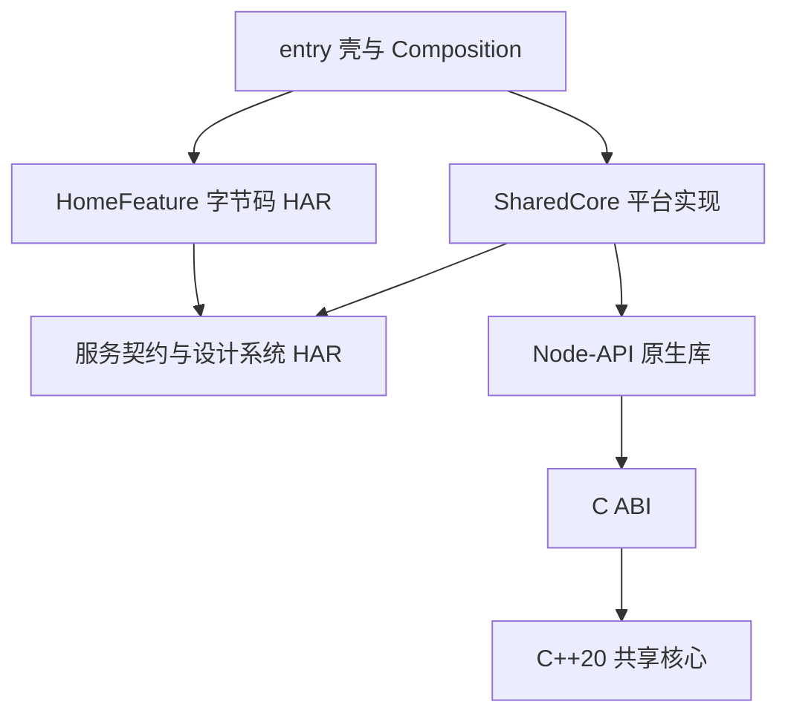

<a id="harmonyos-壳工程与组件架构"></a>
# HarmonyOS Shell and Component Architecture

[中文](harmonyos.md) · Translation of the Chinese primary document.

Updated: 2026-09-24. Status: implemented in the template; device execution, production signing and external delivery require separate acceptance.

This records architecture aligned with Apple/Android and the HarmonyOS adaptations confirmed in this round. Architecture coverage does not establish compatibility with every OS version, processor or application model. See [component validation](../../initiatives/feature/native-components/harmonyos-validation.en.md). Subsequent lifecycle, device interaction, evidence tiers and minimum DI guarantees appear in [shared decisions and gaps](cross-platform-decisions.en.md). These are accepted requirements, but the implementation here does not yet satisfy all of them; confirmation is not completion.

<a id="1-共同基线与平台实现"></a>
## 1. Shared Baseline and Platform Implementation

All three platforms share thin-shell, feature, service-contract, platform-adapter and C++20 core responsibilities and dependency direction. `shared/core/` is the sole source; `scripts/sync-shared-core` synchronizes three self-contained templates and rejects byte drift in check mode. Generated projects need no other template or runtime source download. Source and C ABI are shared; OS binaries are not.

HarmonyOS uses ArkTS/ArkUI, Stage, Node-API, CMake, ohpm and hvigor. Components ship as bytecode HAR. The static C++ core is linked into the sole Node-API `libbiucing_shared.so`; SharedCore ships architecture slices and ArkTS wrappers. Features never carry a second native core.



<a id="2-a01a20-决策映射"></a>
## 2. A01–A20 Decision Mapping

| Decision | HarmonyOS implementation |
| --- | --- |
| A01 Memory | Copy ordinary inputs; type-tag native objects; shared ownership retains resources; C ABI creators provide destruction |
| A02 Errors | Stable integer codes and per-call diagnostics; no C++ exceptions cross boundaries; UI does not display raw diagnostics |
| A03 Threads | ArkTS Promise queue serializes each session; Node-API async work executes expensive core operations; independent sessions may run concurrently |
| A04 Lifecycle | Cooperative Cancellation; close rejects new work, cancels active work, drains the queue then releases; repeat close safe |
| A05 Data | Fixed-width C integers; int64 maps losslessly through decimal strings, never floating-point number |
| A06 Granularity | Reuse bounded batch analysis and failure-without-commit; no business-rule duplication in bridges |
| A07 Repository/devices | One product repository covers phone/tablet/2in1/wearable/tv; one entry currently adapts by capability |
| A08 Modules | Contracts, shared core and complete features are stable release boundaries; source workspace separated from shell build graph |
| A09 UI | Shared HomeModel/HomeFactory; device-specific compact layouts, focus and font sizes; business code does not inspect device type |
| A10 DI | Explicit construction; small graph generator checks missing bindings/cycles; ArkTS compilation checks real signatures |
| A11 Communication | HomeOutput expresses navigation intent; entry owns routing; no internal component objects or native handles passed |
| A12 Verification | Core C tests, real host Node-API, wrapper/model behavior, Hypium, device test packages and artifact acceptance |
| A13 Business | One authoritative C++ core; ArkTS handles interaction/platform flows; still an example use case |
| A14 Persistence | Shared format/migration and platform storage principles retained; no example database or synchronization added |
| A15 Delivery | Shell consumes precompiled bytecode HAR; source-removed builds verified; manifest contract supports external component repositories |
| A16 Debugging | Explicit local binary overrides; versions/dependencies/provenance diagnosable; CI/Release reject overrides |
| A17 Versions | Independent semantic versions, exact complete combination locks, manifests/digests; versions immutable |
| A18 Resources | Feature resources ship with HAR; design tokens belong to contract/design-system SDK; application resources to entry/AppScope |
| A19 Linking | SharedCore exclusively owns core/native bridge; static core linked into controlled .so; libc++ shared runtime included |
| A20 DI/SDK | Internal construction code generated before component publication; shell reads public factories/its own descriptions; no DI types in SDK API |

<a id="3-已确认的六项-harmonyos-决策"></a>
## 3. Six Confirmed HarmonyOS Decisions

1. Phones, tablets, 2in1, watches and TVs are in scope; one repository does not require equal features or release cadence.
2. Reuse C++20/C ABI; ArkTS handles UI/interaction/platform adaptation; Node-API only converts and forwards.
3. Precompiled delivery, independent versions and exact locks from the start; explicitly enable local overrides.
4. Unified core delivery, no duplicate in-process implementation, multiple independent sessions; no raw handles across processes.
5. Explicit injection/scopes and layered build checks; public APIs independent of DI tools.
6. Pin a validated toolchain combination; record support conditions and acceptance tiers per device.

Actual builds selected bytecode HAR plus static core/Node-API .so. No HSP is introduced. Future runtime sharing across HAPs needs separate evaluation of package duplication, state and loading boundaries.

<a id="4-工程与发布单元"></a>
## 4. Project and Release Units

```text
Product/
  AppScope/                       # 应用标识、图标、版本
  entry/                          # 生命周期、根导航、平台组装与壳测试
  composition/di.json              # 只依赖公开工厂的壳构造图
  dependencies/                   # 组件声明、精确锁、工具链契约
  components/                     # 独立 SDK 开发工作区，不进入产品构建图
    contracts/                    # 接口、取消对象、设计 token、公开样式
    sharedcore/                   # ArkTS 包装、Node-API、native 构建
    homefeature/                  # 模型、工厂、ArkUI、资源、内部构造图
  shared/core/                    # 可移植核心源码与 C 测试
  scripts/                        # 发布、解析、安装、校验、DI 和测试
```

Release units: contracts, sharedcore and homefeature. The latter two depend exactly on contracts. HomeFeature does not directly depend on SharedCore; the shell injects AnalysisService. Contracts/design tokens initially share one SDK; each logical module need not have its own repository.

Publication creates isolated build workspaces; downstream consumes published contracts HAR only. Development paths become exact versions in delivery manifests; artifacts contain no ArkTS/C++ implementation source. Publication directories include HAR, source digests, toolchain/dependency/file digests and unstripped native symbols. Source maps/symbols identify build provenance; debugging still requires matching source and path mappings.

<a id="5-生命周期与作用域"></a>
## 5. Lifecycle and Scopes

Entry composition owns application-level SharedCoreFactory. Each WindowStage creates its own SessionOwner and passes a stable HomeModel through local LocalStorage. Features never access AppStorage/global containers. Hiding, obstruction and backgrounding do not close sessions; stage/ability destruction explicitly closes and records completion/errors. HomeModel rejects work after close, cancels in-flight tasks and waits for actual completion; old results cannot update a closed model. Mobile/Desktop/Watch/TV share business models with separate interactions. Real ArkUI observation, input and window behavior await device validation; see [this round's evidence](../../initiatives/feature/native-components/cross-platform-validation.en.md).

ArkTS wrappers copy/queue input; queued operations cannot start after close; active work receives cancellation. Native Jobs retain session resources so GC cannot destroy active C++ objects. Close waits for actual completion before release, distinguishing cancellation requests from ended work. Native APIs also reject overlapping session operations and premature destruction. Normal errors use numeric codes.

No progress callbacks, persistence side effects or cross-device synchronization exist in this example. Future additions must follow Apple's six cross-language contracts, defining threads, commit points, idempotency and stale notification handling.

<a id="6-di-与构建校验"></a>
## 6. DI and Build Checks

`scripts/di` is a bundled construction-graph generator, not a runtime container. Component descriptions generate ordinary `new HomeModel(service)`; shell descriptions generate public factory calls. Missing/duplicate bindings and invalid cycles fail first; ArkTS then checks generated calls against real types. No binary internal source scans or description files in public SDK APIs.

Public factories/resource owners manage scopes. The tool neither infers scopes nor validates close/concurrency semantics; behavior tests cover them. Do not edit generated code; unchanged inputs avoid output rewrites. A component generates independently from its description, without other component sources.

D04 retains this tool instead of TheRouter/ArkDI. Record static gaps and test nested scopes, independent sessions and async disposal; do not claim full compile-time scope guarantees.

Product hvigorfile checks toolchain, locked artifacts and installed SDK bytes during configuration, generating only the shell graph. IDE/CLI builds share this entrypoint. Release reads buildMode from hvigor parameters and rejects overrides.

<a id="7-依赖覆盖与回滚"></a>
## 7. Dependencies, Overrides and Rollback

Initial `make components-bootstrap` explicitly produces, locks and installs initial SDKs. Later shell builds do not produce missing SDKs, rewrite locks or fall back to source. Team consumption uses `components resolve`, `components install`, `make build`.

- `dependencies/components.json` selects exact versions; `components.lock.json` binds manifest digests.
- `.artifacts/components/` is the immutable default local registry; `COMPONENT_REGISTRY` supports synchronized directories.
- `.biucing/components/` holds validated consumer copies; installed bytes are compared with HAR.
- Override records are Git-ignored; explicitly set/clear then reinstall; dependencies must still match the full locked combination.
- Upgrade by publishing a new version, explicitly changing declarations/locks, resolving, installing, building and accepting; never overwrite versions.
- Rollback restores previous locks; real persistence migrations must preserve old-version readability.

External registries, authentication, symbol and signing services are not automatically configured. Independently published binaries do not imply hot replacement in installed apps.

<a id="8-工具链与设备边界"></a>
## 8. Toolchain and Device Boundaries

Pinned: SDK 6.1.1.125, hvigor plugin 6.24.4, ohpm 6.1.2.285, Node 18.20.1, Native Clang 15.0.4, CMake 3.28.2. Python 3.11+ drives delivery/DI. Existing CLI parameters generate compatible/target SDK versions in the toolchain contract; shell and SDK must agree. Version changes require rebuild/acceptance, not a manifest-only compatibility claim.

This SDK accepts arm64-v8a/x86_64 and rejects armeabi-v7a. Packaging accepts phone/tablet/2in1/wearable/tv declarations; that does not establish every device supports this SDK/API/native library, especially lightweight wearables using another application model. Check OS/API, CPU, capabilities and distribution conditions per product, then perform hardware interaction, focus, crown, window and accessibility acceptance.

<a id="9-参考依据"></a>
## 9. References

- [Apple architecture baseline](apple.en.md)
- [Android architecture baseline](android.en.md)
- [Huawei: HAR format and multi-package copying](https://developer.huawei.com/consumer/cn/doc/doccenter-dev-faq/faqs-package-structure-72)
- [Huawei: Node-API asynchronous work](https://developer.huawei.com/consumer/cn/doc/doccenter-capabilities/use-napi-asynchronous-task)
- Local pinned SDK schemas, Node-API headers and actual hvigor/ArkTS compilation results.
