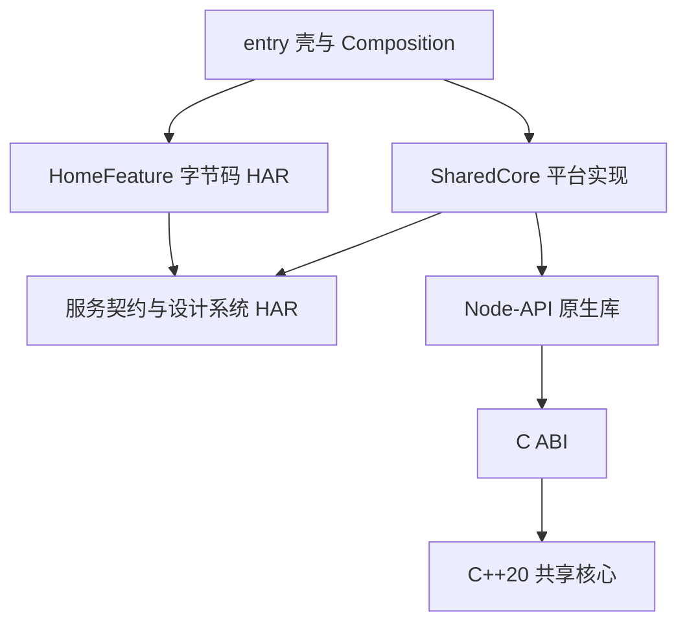

# HarmonyOS 壳工程与组件架构

更新：2026-09-24。状态：已落实到模版；设备运行、真实签名与外部交付另行验收。

本文记录与 Apple、Android 对齐的架构决策，以及本轮逐项确认的 HarmonyOS 适配方案。
“架构覆盖设备”不等于该设备的所有系统版本、处理器或应用模型均可运行此模版。
验收记录见 [HarmonyOS 组件验证](harmonyos-component-verification.md)。

后续确认的生命周期、多设备交互、分级验收及 DI 最低保证见
[三端共同架构决策与差距清单](cross-platform-architecture-decisions.md)。
这些要求已接受，但本页所述现有实现尚未全部满足；不得将决策确认等同于实施完成。

## 1. 共同基线与平台实现

三端统一薄壳、功能组件、服务契约、平台适配、C++20 核心的职责与依赖方向。
共享核心以仓库 `shared/core/` 为唯一源码来源，`scripts/sync-shared-core` 同步到三套
自包含模版；检查模式逐字节拒绝漂移。生成工程不依赖其他模版或运行时源码下载。
共享源码和 C ABI，不共享跨操作系统二进制。

HarmonyOS 使用 ArkTS/ArkUI、Stage 模型、Node-API、CMake、ohpm 和 hvigor。
组件以字节码 HAR 交付；C++ 静态核心并入唯一的 Node-API `libbiucing_shared.so`，
SharedCore 携带对应架构切片及配套 ArkTS 包装。功能组件不携带第二份 native 核心。



## 2. A01–A20 决策映射

| 决策 | HarmonyOS 落实方式 |
| --- | --- |
| A01 内存 | 普通输入复制；原生对象带类型标记；共享所有权保活；C ABI 创建者提供销毁入口 |
| A02 错误 | 稳定整数 code、调用独立诊断；C++ 异常不越界；UI 不直接展示底层诊断 |
| A03 线程 | ArkTS Promise 队列串行化同一会话；Node-API async work 执行耗时核心操作；不同会话可并行 |
| A04 生命周期 | Cancellation 协作取消；关闭拒绝新任务、取消活动任务、等待队列结束后释放；重复关闭安全 |
| A05 数据 | C 接口固定宽度整数；示例 int64 使用十进制字符串无损映射，不经过浮点 number |
| A06 粒度 | 复用已有有界批量分析操作及失败不提交语义；不在桥接层复制业务规则 |
| A07 仓库/设备 | 同一产品仓库覆盖 phone、tablet、2in1、wearable、tv；当前使用一个 entry，按能力适配 |
| A08 模块 | 契约、共享核心、完整功能三类稳定发布边界；源码工作区与壳构建图分离 |
| A09 界面 | 共享 HomeModel/HomeFactory；按设备提供紧凑布局、焦点和不同字号；业务不判断设备类型 |
| A10 DI | 显式构造；小型构造图生成器检查缺失绑定和环路，ArkTS 编译检查真实签名 |
| A11 通信 | HomeOutput 表达导航意图，entry 决定路由；不传递其他组件内部对象或原生句柄 |
| A12 验证 | 核心 C 测试、真实宿主 Node-API、包装/模型行为、Hypium、设备测试包和产物验收 |
| A13 业务 | 同一权威 C++ 核心；ArkTS 负责交互和平台流程；当前仍为示例用例 |
| A14 持久化 | 继承共享格式/迁移与平台存储适配原则；当前没有增加示例数据库或同步实现 |
| A15 交付 | 壳消费预编译字节码 HAR；实际验证移除组件源码后构建；支持按清单契约接入外部组件仓库 |
| A16 联调 | 显式本地二进制覆盖；版本/依赖/来源可诊断；CI 与 Release 拒绝覆盖 |
| A17 版本 | 独立语义版本、完整组合精确锁定、清单与产物摘要；同版本禁止覆盖 |
| A18 资源 | 功能资源随 HAR 发布，设计 token 归契约/设计系统 SDK；应用资源归 entry/AppScope |
| A19 链接 | SharedCore 独占核心和原生桥接；静态核心并入受控 .so；libc++ 共享运行库随产物交付 |
| A20 DI/SDK | 组件发布前生成内部构造代码；壳只读公开工厂及自身描述；SDK API 不暴露 DI 类型 |

## 3. 已确认的六项 HarmonyOS 决策

1. 手机、平板、2in1、手表、电视全部纳入架构范围，同仓但不要求功能或发布节奏相同。
2. 复用 C++20/C ABI；ArkTS 负责界面、交互与平台适配，Node-API 只转换和转发。
3. 从开始就预编译交付、独立版本化、精确锁定，本地覆盖显式启用。
4. 公共核心统一交付；同进程避免重复实现，允许多个独立会话；不同进程不共享裸句柄。
5. 显式注入、明确作用域、分层构建期校验，公开接口独立于 DI 工具。
6. 固定经过验证的工具链组合，按设备记录支持条件与不同层次的验收结果。

当前已经通过真实构建选择字节码 HAR 和静态核心加 Node-API .so 的组合。
不引入 HSP；如未来多 HAP 需要运行时共享，应单独评估重复包体、状态和加载边界。

## 4. 工程与发布单元

```text
Product/
  AppScope/                       # 应用标识、图标、版本
  entry/                          # 生命周期、根导航、平台组装与壳测试
  composition/di.json              # 只依赖公开工厂的壳构造图
  dependencies/                   # 组件声明、精确锁、工具链契约
  components/                     # 独立 SDK 开发工作区，不进入产品构建图
    contracts/                    # 接口、取消对象、设计 token、公开样式
    sharedcore/                   # ArkTS 包装、Node-API、native 构建
    homefeature/                  # 模型、工厂、ArkUI、资源、内部构造图
  shared/core/                    # 可移植核心源码与 C 测试
  scripts/                        # 发布、解析、安装、校验、DI 和测试
```

三个发布单元为 contracts、sharedcore、homefeature。后两者精确依赖 contracts；
HomeFeature 不直接依赖 SharedCore，由壳通过 AnalysisService 注入。
契约和设计 token 同属一个初始 SDK，不要求每个逻辑模块单独建仓。

发布工具为每个组件建立隔离构建工作区；下游只消费已发布 contracts HAR。
开发路径在交付清单中转为精确版本；产物不携带 ArkTS/C++ 实现源码。
发布目录包含 HAR、源码摘要、工具链、依赖、文件摘要和原生未剥离符号。
源码映射/符号用于定位构建来源，开发者仍需获取匹配源码并配置调试路径映射。

## 5. 生命周期与作用域

entry 的组装层持有应用级 SharedCoreFactory；每次显示 HomeView 通过公开工厂创建
独立模型和会话。功能组件本身不访问 AppStorage 或全局容器。页面离开时显式关闭，
再次进入获得新会话；旧任务结果不允许更新新会话的界面。

以上描述当前实现。新确认的 D01 要求会话跟随业务所有者，不能仅因视图暂时不可见就关闭；
现有 aboutToAppear/aboutToDisappear 管理方式列入待整改，当前尚未修改代码。

ArkTS 包装复制输入并排队，关闭后排队操作拒绝开始；活动任务接收取消请求。
原生 Job 自持会话资源，垃圾回收不能提前销毁正在使用的 C++ 对象。
关闭等待真实操作结束后释放，不把“请求取消”当作“任务已结束”。
原生接口也拒绝同会话重叠操作和活动期间提前销毁。正常错误以数值 code 判断。

目前示例无进度回调、持久化副作用、跨设备同步；后续加入时仍须遵守 Apple 六项
跨语言契约，明确线程、提交点、幂等性与过期通知处理。

## 6. DI 与构建校验

`scripts/di` 是随模版发布的构造图生成器，不是运行时容器。
组件描述生成普通 `new HomeModel(service)`，壳描述生成公开工厂调用。
缺失绑定、重复绑定、非法环路先失败，ArkTS 编译再检查生成调用与真实类型一致性。
不扫描二进制内部源码、不把描述文件作为 SDK 公共 API 发布。

作用域由公开工厂及资源 owner 明确管理；该工具不推导作用域、不验证关闭或并发语义。
这些由行为测试覆盖。生成代码不手工修改，输入不变时不重写输出。
组件可单独按其描述生成，不要求同时存在其他组件源码。

按共同决策 D04，暂保留该工具，不引入 TheRouter 或 ArkDI；已知静态检查缺口必须明确记录，
并补充嵌套作用域、独立会话和异步释放测试，不宣称具有完整编译期作用域保证。

产品 hvigorfile 在配置时校验工具链、锁定产物和实际安装的 SDK 字节，并只生成壳图。
IDE 直接构建与 CLI 使用同一入口。Release 从 hvigor 参数读取 buildMode，拒绝覆盖。

## 7. 依赖、覆盖与回滚

初次执行 `make components-bootstrap` 显式生产初始 SDK、锁定和安装。
之后壳构建不会自动生产缺失 SDK、改写版本锁或回退到源码。
团队消费流程为 `components resolve`、`components install`、`make build`。

- `dependencies/components.json` 选择精确版本；`components.lock.json` 绑定清单摘要。
- `.artifacts/components/` 是默认不可变本地产物仓库；`COMPONENT_REGISTRY` 支持同步后的目录。
- `.biucing/components/` 是校验后的消费副本；安装包字节再与 HAR 比对。
- 覆盖记录位于 Git 忽略目录，显式设置/清除后重新安装；依赖仍须匹配完整锁定组合。
- 升级先发布新版本，再显式改声明、锁定、解析、安装、构建和验收；版本不可覆盖。
- 回滚恢复上一套锁；真实产品有持久化迁移时还须保证旧版本可读。

外部仓库、认证、符号服务器和签名服务未自动配置。
二进制独立发布不代表已安装应用能热替换代码。

## 8. 工具链与设备边界

当前固定 SDK 6.1.1.125、hvigor plugin 6.24.4、ohpm 6.1.2.285、Node 18.20.1、
Native Clang 15.0.4 和 CMake 3.28.2；Python 3.11+ 驱动交付与 DI 工具。
兼容/目标 SDK 仍由已有 CLI 参数生成，记录在工具链契约中，壳和 SDK 必须一致。
修改版本组合后需重新构建和验收，不能仅修改清单来宣布兼容。

当前 SDK 实际接受 arm64-v8a 和 x86_64，拒绝 armeabi-v7a。
phone/tablet/2in1/wearable/tv 声明已通过打包，但不表示所有这些设备都支持此 SDK/API
和原生库。尤其不覆盖另一应用模型的轻量穿戴设备。具体产品按设备系统/API、CPU、
可用系统能力和分发条件确认可用性，再执行真机交互、焦点、旋钮、窗口及无障碍验收。

## 9. 参考依据

- [Apple 架构基线](apple-shell-component-architecture.md)
- [Android 架构基线](android-shell-component-architecture.md)
- [华为：HAR 产物格式及多包复制](https://developer.huawei.com/consumer/cn/doc/doccenter-dev-faq/faqs-package-structure-72)
- [华为：Node-API 异步任务](https://developer.huawei.com/consumer/cn/doc/doccenter-capabilities/use-napi-asynchronous-task)
- 本机固定 SDK 的 schema、Node-API 头文件与真实 hvigor/ArkTS 编译结果。
