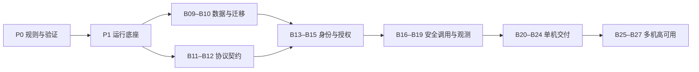

# Backend Service Architecture Implementation Tasks

[中文](plan.md) · Translation of the Chinese primary document.

> Initiative material: historical background, design or acceptance for this stage. See the [documentation map](../../../README.en.md) for current usage.

Status reviewed 2026-10-09: P0–P4/B01–B24 implemented with scoped acceptance. B25/B26 Kubernetes reference/local validation complete. B27 real cross-zone HA drill paused; optional extensions excluded from default delivery. Claims follow each stage's actual evidence. See [P0 contracts](../../../engineering/backend/contracts.en.md)/[evidence](p0-validation.en.md).

Based on [overall](../../../engineering/backend/architecture.en.md), [Web](../../../engineering/backend/web-service.en.md), [Micro](../../../engineering/backend/micro-service.en.md). This is an execution checklist; boundary changes update architecture too. No release version, schedule or owner assigned; allocate by task size at execution.

## 1. Scope and Current State

Web: end users, Go/Gin/REST/JSON/OpenAPI/OIDC/browser sessions/mobile access tokens. Micro: services, Go/gRPC/Protobuf/Buf/mTLS/method authorization. Both independently generate/develop/test/build through Docker and deploy standalone Compose. Kubernetes/managed PG HA is a separate stage. No todo/order/inventory/tenant business; minimal technical fixtures cover protocols, identity, data/failure. Web need not depend on Micro; stateless Micro need not configure a database.

| Existing baseline | Treatment |
| --- | --- |
| Docker/Make/worktree | Reuse/unify; separate dev/prod config and runtime constraints |
| Health/timeouts/shutdown | Add startup cleanup/readiness/drain/failure checks |
| Web memory/Micro Ping | Minimal technical fixtures, no production business claim |
| DB/Redis/telemetry/Buf | Real integration, separate DB/cache roles, end-to-end proof |
| Build records/maturity | Preserve historical meaning; update claims only after new proof |

## 2. Stages and Completion Gates

B01–B24 scoped delivery and B25/B26 reference complete; B27 waits for facilities/resume authorization. Extensions remain backlog. Completion requires generated-project evidence, not source-file checkmarks.

| Stage | Tasks | Gate |
| --- | --- | --- |
| P0 Rules/harness | B01–03 | Recorded scope/config/selections, repeatable two-project generation/validation |
| P1 Runtime | B04–08 | Docker startup/config failure/limits/health/exit evidence |
| P2 Protocol/identity/data | B09–15 | Actual authentication/authorization, DB/migrations/sessions |
| P3 Calls/observability | B16–19 | Secure independent calls, bounded/observable failure |
| P4 Standalone production | B20–24 | Images/Compose/release rollback/data restoration drills |
| P5 HA reference | B25–27 | Kustomize/platform contracts and conditional real drills |
| E Optional | E01–14 | Component-specific acceptance, outside baseline |

Stages are acceptance groups, not mandatory serial order. Dependencies:

## 3. Default Baseline Tasks

Each task is independently reviewable; large tasks may span PRs but complete only when all acceptance passes.

### P0: Rules and Validation Harness

#### B01 — Engineering Contracts and Unresolved Selections

Completed within P0. No dependencies. Deliver directory responsibilities/direction/matrix, migration tool, one proxy, local IdP/cert plan, compatible pins. Acceptance records reasons/upgrade/replacement; apps do not require CLI; DB/cache/proxy/telemetry duties clear, no large shared framework.

#### B02 — Generation Configuration and Compatibility

Completed within P0. Depends B01. Separate dependency_store DB/cache semantics, component combinations, rules/metadata/CLI/docs/goldens. Web PG session config required; stateless Micro works without DB; invalid combinations clear; old config treatment explicit; micro-service public name, no microservice alias.

#### B03 — Continuous Generated-Project Harness

Completed within P0. Depends B01. Two-template generation→Docker scripts, initial CI/evidence format, incrementally extended. Fresh directories/nondefault names/module/proto; CLI/resource/package/project results separated; no host Go required.

### P1: Shared Runtime Foundation

Completed; Docker/worktree/config/request evidence: [P1](p1-validation.en.md).

#### B04 — Unified Docker Development

Depends B02/B03. Dev/runtime Dockerfiles/compose; bootstrap/dev/verify/image/migrate/up/down/logs/doctor semantics and migration. Docker+Compose+Git sufficient; two worktrees isolate ports/volumes/mutable builds; down retains data; destructive cleanup explicit; permissions/reload work.

#### B05 — Typed Configuration, Secrets and Startup

Depends B04. Precedence/validation/file secrets/redacted diagnostics; explicit assembly/order/cleanup/version; rotation/restart. Invalid config fails before ready, partial startup releases resources, no passwords/tokens/keys in logs, env/_FILE conflict deterministic, dev credentials never silently production.

#### B06 — Common Request Pipeline

Depends B05. HTTP middleware/gRPC unary-stream interceptors: IDs/recovery/validation/size/deadline/cancel/concurrency; Principal/policy. Predictable errors/panics/limits/cancel; protected routes default deny; constrained IDs; streams cannot bypass identity/limits. B13–15 provide authenticators.

#### B07 — Health, Operations and Shutdown

Depends B05/B06. live/ready/gRPC health/startup/private admin, dependency classification, SIGTERM bounded drain/force. Stop new traffic first; complete/terminate within budget; DB failures not liveness loops; optional telemetry not readiness blocker; diagnostics/version/metrics private; reflection/pprof disabled/protected.

#### B08 — Structured Logs and Audit Interface

Depends B05/B06. slog JSON/levels/correlation/redaction; security events for identity/permission/config, platform retention. Link errors without user stacks, no default body/Cookie/Authorization, test redaction, sample/rate-limit frequent logs, audit distinguished from debug.

### P2: Protocols, Identity and Data

Completed; choices/limits/real Docker/DB/identity/breaking: [P2](p2-validation.en.md).

#### B09 — PostgreSQL and Data Ownership

Depends B05/B03. pgx pool/transactions/timeouts/budgets/TLS/least privilege/real tests. Rollback/cancel/exhaustion/reconnect; total connections×instances documented; separate DB/roles prevent cross-table access; stateless Micro no mandatory pool.

#### B10 — Separate Migrations and Compatibility

Depends B09. Version SQL/separate container/entrypoint/mutex/failure recovery/schema check; separate runtime/migration credentials. Empty/upgrade/concurrent/failure evidence; replicas never auto migrate; pipeline once before rollout; expand→migrate→contract, incompatible schemas not with old apps; rollback does not assume reversible DB.

#### B11 — Web HTTP Contract

Depends B06/B03. OpenAPI/errors/status/version, request/response validation, pagination/idempotency/concurrency conventions, public/protected routes. Contract match, sanitized errors, CI breaking, no mandatory generic wrappers on all APIs, minimal fixtures.

#### B12 — Micro RPC Contract

Depends B06/B03. Protobuf packages/version, Buf lint/breaking/reproducible generation/status-details/consumption. Real baseline breaking, unknown/invalid fields/bounds explicit, no server internals import, fixed/repeatable generation.

#### B13 — Web OIDC and Mobile Tokens

Depends B11/B05/B08. Code/PKCE/state/nonce/callback allowlist/JWKS cache-refresh, API token validator/local IdP. issuer/audience/signature/time/purpose; ID token not access token; invalid/expired/untrusted rejected; IdP outage only locally verifiable valid credentials continue, unknown keys deny; no dev IdP in prod defaults.

#### B14 — PG Browser Sessions and Edge Protection

Depends B09/B10/B13. Opaque ID/table/Cookie/rotation/logout/expiry cleanup/CSRF/exact CORS, sensitive token storage/rotation. No browser refresh token, shared multi-instance sessions, logout/expiry, fixation/cross-site write/concurrent refresh tests; outage lifetime bounded, cleanup not per-replica repeated scheduling.

#### B15 — Micro mTLS, Methods and User Context

Depends B12/B05/B08. Mutual cert checks/identity/method allowlist/root-cert rotation/trusted delegation/local CA. Reject absent/wrong/expired cert or method; identity from verified certificate; only authorized services assert bounded/validated user context, strip end-user fields, reauthorize each hop; service-only calls need no fake user; no private keys committed.

### P3: Calls and Observability

Completed; clients/budgets/independent calls/failure evidence: [P3](p3-validation.en.md).

#### B16 — Outbound HTTP/gRPC Clients

Depends B05/B12/B15. Construction/disposal/reuse/TLS/mTLS/address/DNS/LB/rotation/context. Both can call; cert and identity match; no default Cookie/Authorization forwarding; recover address/connection changes, no per-request connection, independent versions.

#### B17 — Reliability and Resource Budgets

Depends B16/B06. End-to-end/subcall deadlines/cancel, bounded backoff/jitter, operation retries, per-dependency bulkheads/backpressure/breaker extension, process vs global rate limits. Timeout does not imply no execution; no automatic non-idempotent retry; retries at one declared layer/total budget; slow dependencies do not exhaust resources; no recovery burst; errors/rejection/degradation distinct.

#### B18 — Metrics, Tracing and Operations

Depends B07/B08/B09/B16. OTel HTTP/gRPC/DB/resource/propagation; latency/errors/traffic/saturation/pool/retry; Collector/optional viewing/alerts. Web→Micro trace/log links; no user/URL high-cardinality labels; bounded queues/sampling/timeouts; exporter failures not requests; Collector not long-term storage, deployer retention/alerts.

#### B19 — Independent Generated-Project Calls

Depends B10–18. Repository harness separately generates images/config/DB roles; user→Web→mTLS→Micro technical fixture. Success/no user/service permission/forged context/deadline/cancel/rotation/restart/IdP outage; each works alone; helpers not default public production APIs.

### P4: Standalone Production Delivery

Completed for template/local acceptance: [P4](p4-validation.en.md). Actual GitHub OIDC/GHCR, remote DR and HA require target-platform acceptance.

#### B20 — Production Images and Compose

Depends B04–07/B10/B14/B15/B18. compose.prod/proxy/TLS/routes/secrets/networks/budgets/digests/multistage/nonroot/least privilege/read-only/tmpfs. Pull only, no source mount/build; only proxy public, DB/RPC/admin private; log rotation/restart/grace; unhealthy does not automatically restart/unroute, validate failure; fixed dev/prod combination.

#### B21 — CI and Image Supply Chain

Depends B03/B19/B20. Format/static→tests/real dependencies/contracts/migrations→image→scan/SBOM/provenance/sign→nonroot smoke; predeploy digest/signature. Fail blocks, scan exception/remediation rules, no secrets in layers/logs, separated build/publish rights, local build no prod credentials, only verified platforms claimed.

#### B22 — Release, Migration, Rollback and Runbooks

Depends B10/B20/B21. Initial/update/config-cert rotation/mutex/version/rollback/troubleshooting, standalone outage or traffic switching. Stop bad/not-ready/migration failure; compatible prior image rollback; honest interruption window, no Compose zero-downtime claim; host secret permissions/rotation responsibilities.

#### B23 — Backup Restore and Standalone Failure

Depends B20/B22/B18. PG backup/restore entries/separate failure-domain storage; process/container/DB/disk/slow/telemetry drills/records. Real isolated restored data, volumes not backups, record time/recoverable point before targets, container replacement retains state, host-loss limitation, no default prod drills.

#### B24 — Template Acceptance and Documentation

Depends B19/B21–23. Matrix/checklist/README/metadata/two profiles, installed templates. Wheel/sdist fresh generation/Docker/standalone; combinations/goldens/resources/worktree pass; reproducible docs and evidence claims, old validated not new baseline proof.

### P5: Multi-Machine HA Reference

B25/B26 reference/local complete; B27 awaits real cross-zone cluster/managed PG. [P5](p5-validation.en.md); manifests do not establish HA.

#### B25 — Kubernetes/Kustomize and Platform Contract

Reference/tool/contracts complete, cluster behavior B27. Depends B24. Base/overlays: Deployments/Services/probes/budgets/spreading/rollout/PDB/NetworkPolicy/Secret refs; ingress/workload certs/DNS/monitoring/managed PG. Same OCI no app changes; no real Secrets; CNI/cert prerequisites; local vs real evidence separate; no Swarm.

#### B26 — Cluster Delivery and Capacity/Failure Budgets

Reference/tool/contracts complete, cluster behavior B27. Depends B25. Migration Jobs/pipeline, rolling/rollback/scaling, replica/DB budget, node/zone capacity, PG failover contract. No connection exhaustion; drain/probe/ingress align; maintenance vs involuntary loss, PDB not guarantee; absent facilities means manifests only.

#### B27 — HA Scenario Acceptance

Pending actual facilities. Checklist/read-only observation/not-run template delivered; no available context/cross-zone/PG failure environment. Depends B26/B23. Node/zone/DB/cert/bad-release/recovery reports; propose targets from observations. Record traffic/errors/time/consistency/manual steps/facilities/single points; pending without environment, not YAML success.

## 4. Optional Extension Catalog

Disabled by default. B02 reserves clear config, no empty implementations/abstractions. Starting each needs a small decision record: use case/implementation/app-infra responsibility/config/failure/upgrade/removal. Common gate: independent enablement, Docker dev, production contract, observability/access control/real integration.

| ID | Task | Dependencies | Acceptance |
| --- | --- | --- | --- |
| E01 | Redis cache/shared quotas | B02/B17/B18 | TTL/invalidation/stampede/failure, actual multi-instance global limits |
| E02 | Messaging/event contracts | B12/B17/B18; B09–10 for outbox | confirmations/ack/duplicates/order/retry/backlog/dead letter/replay; no inherent exactly-once |
| E03 | Durable jobs/worker | B07/B09–10/B18; E02 if broker | claims/leases/renewal/cancel/crash/repeatability; align worker template |
| E04 | Scheduler | E03 | timezone/missed/catchup/duplicates; bounded multi-instance execution |
| E05 | S3 objects | B16–18 | auth/size/type/scanning/short URLs/cleanup/DB inconsistency |
| E06 | Search | B09/B18; E02 async | authority/lag/retry/rebuild/switch |
| E07 | WebSocket/SSE/RPC streams | B14–18/B20 | renew auth/limits/backpressure/reconnect/proxy/drain |
| E08 | Webhooks | B16–18; E03 reliable | signature/replay/SSRF/deadline/retry/records |
| E09 | Mail/SMS/push providers | B16–18; E03 reliable | quotas/credentials/duplicates/receipts/privacy; dev no real sends |
| E10 | Coordination | B09 or E01/B17 | prefer constraints/transactions; necessary locks lease/fence, stale owners cannot write |
| E11 | Pagination/idempotency/version helpers | B09–11 | stable scoped/expiring cursor, fingerprints/concurrent duplicates/retention, predictable conflicts |
| E12 | Dynamic config/flags | B05/B08/B18 | versions/audit/last good/fallback, no request dependence on realtime availability |
| E13 | Policy/tenant/audit interfaces | B13–15/B18 | trusted context/boundaries, isolation/anti-forgery/fail closed; no assumed business roles/tables |
| E14 | Gateway/mesh/CDN/WAF/DDoS | B20; B25 cluster | proxy trust/cert termination/identity/retry-rate ownership/bypass protection, actual config |

## 5. Common Definition of Done

1. Change template sources, generate fresh outputs; no output-only fixes.
2. Normal/failure/recovery by risk; real protocol/DB/cert environments, no mock replacement for essential proof.
3. Docker/worktree preserved; config/path/resource changes update validation/goldens/package checks.
4. Update generated/config/command/evidence docs; identify unverified platforms.
5. No committed keys, disabled-component startup dependencies or business models.
6. Record task/PR/commit/commands/environment-image/results/limits; separate documentation from runtime completion.

## 6. Recommended Initial Sequence

| Batch | Scope | Review focus |
| --- | --- | --- |
| 1 | B01 | Fix decisions/boundaries once |
| 2 | B02 | Config compatibility/DB-cache separation |
| 3 | B03 | Reusable continuous baseline |
| 4 | B04 | Docker/dev/worktree |
| 5 | B05 | Config/startup/secrets/cleanup as composition foundation |

P4 local delivery and B25/B26 reference complete; target facilities next for B27. Keep duties aligned through shared test contracts; extract small versioned libraries only after stable duplication. Shared framework is no prerequisite. B24 gates standalone delivery, B27 gates HA.
